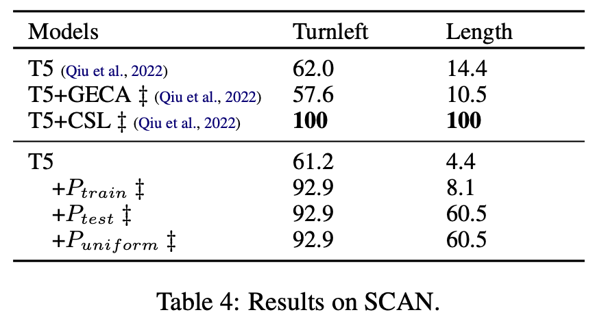

    

## Abstract

Compositional generalization, the ability to predict complex meanings from training on simpler sentences, poses challenges for powerful pretrained seq2seq models. In this paper, we show that data augmentation methods that sample MRs and backtranslate them can be effective for compositional generalization, but only if we sample from the correct distribution.  Remarkably, sampling from a uniform distribution performs almost as well as sampling from the test distribution, and greatly outperforms earlier methods that sampled from the training distribution.We further conduct experiments to investigate the reason why this happens and where the benefit of such data augmentation methods come from. 

The core of our method is a probabilistic grammar for the task meaning representation, which is used to sample unlimited MRs for backtranslation.  Figure 1 illustrates our three experiment settings of the grammar estimation process. Given some context-free grammar rules, we can calculate different probabilistic grammars by estimating the probability of each rule on different data. Previous works exploit this method by estimating on the training set of the task. Differently, we explored three grammars with different parameters (i.e. rule probabilities): Ptrain  estimated on the training set, Ptest estimated on the test set and Puniform  with uniform rule distributions. We use Ptest to show the upperbound of our method but usually we cannot access such test-set data in the realistic world.   

## Method

Our method consists of two steps: sample meaning representations and then backtranslate them into natural language sentences. It exploits the fact that in many realistic use cases of a semantic parser, one can generate arbitrary amounts of symbolic *meaning representations* from a grammar: These  are from a formal language, and the developer of a semantic parser either has access to a grammar for  this formal language or can easily write one.

#### Data augmentation

    

- **Grammar rules:** For a semantic parsing task, we assume a context-free grammar for its meaning representation is given (e.g. Figure 3a for FunQL in GeoQuery.)
- **Parameter estimation:** Given some meaning representations, we can estimate rule parameters with maximum likelihood estimation based on counting rule occurrences in their parse trees (e.g. Figure 3b). 
- **Generate new data:** With the estimated PCFG, we can then sample new meaning representations from it and then backtranslate them into English sentences. To do backtranslation, we train another seq2seq model on the training set which takes as input a meaning representation and outputs the corresponding English sentence. Since the English sentences are generated with backtranslation, it is possible to generate incorrect sentences as shown in Figure 2.

    

## Results

We experimented with four compositional generalization datasets: COGS, CFQ, GeoQuery and SCAN.

  
   

  
   

Our key findings include:

- **Improved Accuracy with Test Set Grammar:** Implementing a grammar estimated on test sets (e.g. Ptest) significantly enhanced performance, leading to near-perfect accuracy in some cases. This was particularly evident in the COGS dataset. In contrast, the grammar estimated on the training set Ptrain only gives a slight improvement over the baseline for most cases. 
- **Uniform Grammar's Effectiveness:** The uniform grammar Puniform  consistently showed high improvement, rivaling the test set grammar in some instances. This was evident across different datasets, suggesting that ampling meaning representations from a uniform PCFG and backtranslating them into natural-language sentences can serve as a simple and efficient data augmentation strategy for compositional generalization

We can also observe that our three strategies are roughly on par with each other on CFQ. We attribute this limitation to the fact that the complexity of certain datasets, like CFQ, which uses variables and conjuncts in SPARQL, posed challenges for context-free grammars. 

To verify our hypothesis, we further experiment with a setting (e.g. +dev MRs in Table 2) where we directly backtranslate MRs from the development set that shares the same distribution of the test set as augmented data. This represents what a perfect method for augmentation from test distribution would achieve. The large improvement indicates that the issue really comes from our flawed grammar. 

## Why Puniform performs so well

According to [Bogin et al, 2022](https://aclanthology.org/2022.emnlp-main.175/), a key feature that makes compositional generalization difficult is the presence of unobserved local structures (i.e. a connected sub-graph that occurs in the meaning representation) in the test set. Is the better performance of Ptest and Puniform actually because they cover more structures in the test set?

To answer this question, we further plot the accuracy of our models against the structure coverage on COGS and GeoQuery in Figure 6. 
For GeoQuery, we consider the template split and follow Bogin et al, 2022 in defining the local structure of a meaning representation as all pairs of parent nodes and their children in its parse tree (i.e.\ 2-LS).
For COGS, we focus on the PP  recursion generalization type. Instead of considering local structures, we observe that the accuracy on such data is related to the maximal recursion depth observed in the train set. Thus we use PP recursion depth as a representative of global structures to calculate the structure coverage. 

    

Our results show that Ptest and Puniform yields a larger coverage of structures that occur in the test set than Ptrain. Furthermore, larger coverage is associated with higher accuracy. This is consistent with Bogin et al, 2022. Although previous works also show the benefit of introducing more complex structures into the train set, our results further suggest that synthesized meaning representations with back-translated sentences can still help. 