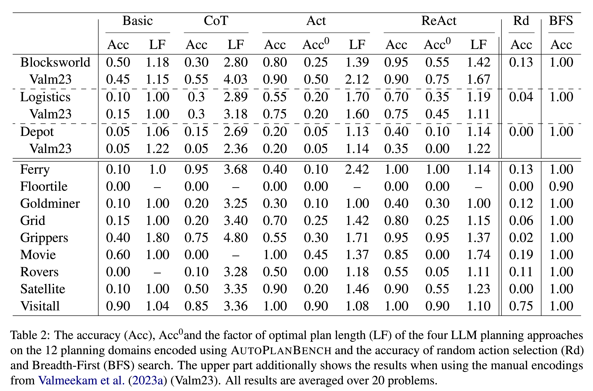

    

**Note on different versions**:  
the previous version of this paper had been published on Arxiv under the title "AutoPlanBench: Automatically generating benchmarks for LLM planners from PDDL" which is currently linked above. This version of the paper will be soon replaced by the updated version "Automating the Generation of Prompts for LLM-based Action Choice in PDDL Planning" that will be published as part of the ICAPS Workshop on Bridging the Gap Between AI Planning and Reinforcement Learning (PRL).  
The repository are already updated and the website is currently being updated. 

## AutoPlanBench

We present **AutoPlanBench**, a tool for **automatically converting classical planning benchmarks from PDDL into natural language** planning tasks. PDDL (Planning Domain Definition Language) planning domains are very popular in the classical AI planning research community and available domains differ with respect to a number of characteristics designed to compare the performance classical planning approaches in different settings.

AutoPlanBench makes these planning tasks available for research on **reasoning and planning with Large Language Models** (LLMs) at a large scale without requiring manual effort or detailed knowledge about PDDL and the domains. We show that the automatically converted planning domains **yield comparable results as manually created** domain descriptions (from Valmeekam et al. 2023: [PlanBench](https://github.com/karthikv792/LLMs-Planning/tree/main/plan-bench)) across different planning domains and LLM planning approaches.
Evaluating LLM planners across a broad range of planning domains, enables us to pinpoint features of planning domains and specific planning problems that make them hard to for LLMs. 

We release the dataset of natural-language conversions of 12 PDDL domains and a small set of NL planning problems for each of them. Additionally, we provide the code for converting more PDDL domains and problems into natural-language planning tasks for LLMs. 

In addition to the code for creating LLM planning problems, we provide the implementation of four different LLM planning approaches as well as the code to automatically generating few-shot examples for these approaches. 

## PDDL to NL Planning Problems

PDDL planning tasks consist of a domain file and a problem file that defines a specific problem instance with respect to the domain. AutoPlanBench converts both the domain PDDL file and problem files into natural language encodings as illustrated below. The details about the LLM-based conversion methodology can be found in our paper.  

**Blocksworld Domain**

 
Blocksworld Example

 
 

**Visitall Domain**

Visitall Example

 
 

## LLM Action-Choice Mechanisms

### Overall Set-up

* **P-LLM**: does the action selection, i.e. predicts a complete plan / the next action given the domain and problem descriptions
* **L-LLM**: translates natural language output of the P-LLM back to PDDL
* **Simulator**: simulates the world state; outputs an observation for an input action; checks plan validity; determines whether the goal is satisfied

### Tested Approaches

|                 | Plan Generation (Non-interactive)                                                                                   | LLM as a policy (Interactive)                                                                                                                                  |
|-----------------|---------------------------------------------------------------------------------------------------|----------------------------------------------------------------------------------------------------------------------------------------------|
| **No Thoughts** | *Basic*   * one complete plan                                                                  | *Act*   * step by step prediction of next action   * observation from the simulator                                                    |
| **Thoughts**    | *CoT*   * Chain-of-Thought (Wei et al. 2022)   * on complete plan   * reasoning thoughts | *ReAct*   * Yao et al. 2023   * step by step prediction of next action   * observation from the simulator   * reasoning thoughts |

  
Full ReAct Example

  
  
  
  
  
  
  
  
  
  
  
  
  
  

## LLM Planning Results 

**Metrics** 
* Coverage: The absolute number of correctly solved instances
    * Plan generation: an instance is considered to be solved correctly in case the goal is satisfied after executing all predicted actions from the generated plan
    * Policy: an instance is considered to be solved correctly in case the goal is satisfied within the specified number of steps; the simulator itself takes care of stopping the generation of further actions in that case

**Results: AutoPlanBench vs. Manual Conversions** 
We find that the automatically converted planning domains (APB) yield comparable results as manually created domain descriptions (Manual; from Valmeekam et al. 2023: [PlanBench](https://github.com/karthikv792/LLMs-Planning/tree/main/plan-bench)) across the different planning domains and LLM planning approaches. (See upper part of Table 2)

**Results: LLM Planning Performance** 
Overall, we find that the planning performance differs considerably between the 12 tested domains. While the best LLM planners (ReAct) do well on some planning tasks, many remain out of reach of current search-based planning methods (see Table 2).

One potential factor influencing the different results across domains is the plan length. Overall, the LLM planners performed better on domains with shorter problems. This could indicate that LLMs are worse at long-term planning or at generalization from shorter demonstrations to larger test problems. 

Additionally, we find that domains with actions that have irreversible effects on the state and where hence dead-end states can occur pose a problem for LLM planners.

