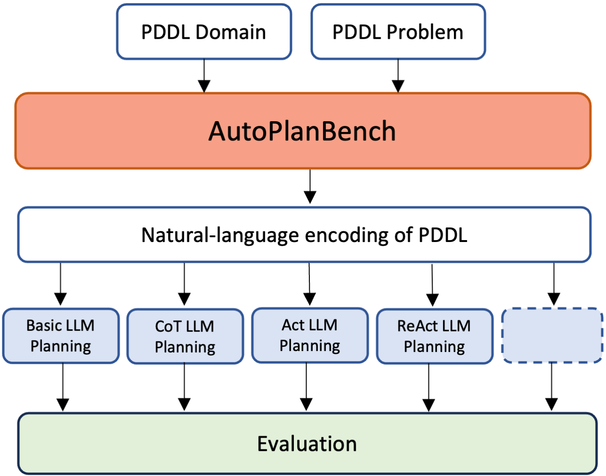

    

## Abstract

LLMs are being increasingly used for planning-style tasks,
but their capabilities for planning and reasoning are poorly understood.
We present a novel method for automatically converting planning benchmarks written in PDDL
into textual descriptions and offer a benchmark dataset
created with our method.
We show that while the best LLM planners do well on many planning tasks,
others remain out of reach of current methods.

## Contribution 
We present AutoPlanBench, a method for automatically converting PDDL problem specifications into benchmarks for LLMs. AutoPlanBench requires no manual effort for running LLM planning on new domains; the PDDL specification is converted into natural language automatically. This makes it possible, for the first time, to investigate the planning capabilities of LLMs at a larger scale, and it ensures that knowledge that the human problem converter might have about the planning domain doesn't accidentally slip into the natural language task. In addition to the code for converting PDDL into language, we are also releasing an initial set of 9 natural-language conversions of complex PDDL problems.

We will release the complete code and data within the next 1-2 days. 
