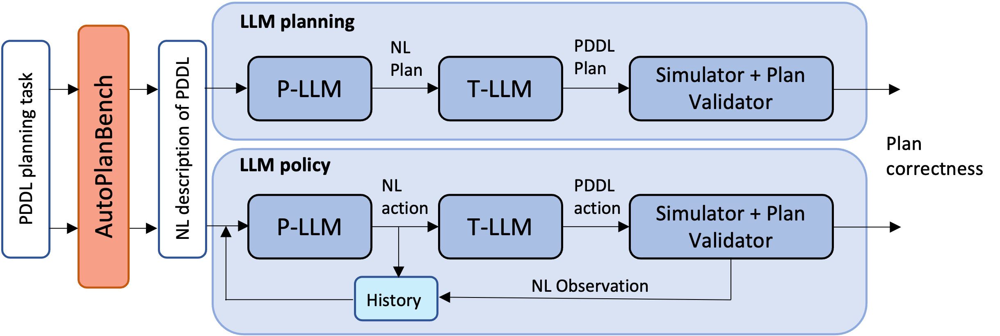
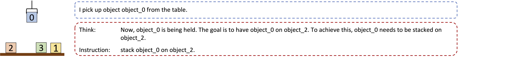

    

## AutoPlanBench

We present **AutoPlanBench**, a tool for **automatically converting classical planning benchmarks from PDDL into natural language** planning tasks. PDDL (Planning Domain Definition Language) planning domains are very popular in the classical AI planning research community and available domains differ with respect to a number of characteristics designed to compare the performance classical planning approaches in different settings.

AutoPlanBench makes these planning tasks available for research on **reasoning and planning with Large Language Models** (LLMs) at a large scale without requiring manual effort or detailed knowledge about PDDL and the domains. We show that the automatically converted planning domains **yield comparable results as manually created** domain descriptions (from Valmeekam et al. 2023: [PlanBench](https://github.com/karthikv792/LLMs-Planning/tree/main/plan-bench)) across different planning domains and LLM planning approaches.
Evaluating LLM planners across a broad range of planning domains, enables us to pinpoint features of planning domains and specific planning problems that make them hard to for LLMs. 

We release the dataset of natural-language conversions of 12 PDDL domains and a small set of NL planning problems for each of them. Additionally, we provide the code for converting more PDDL domains and problems into natural-language planning tasks for LLMs. 

In addition to the code for creating LLM planning problems, we provide the implementation of four different LLM planning approaches as well as the code to automatically generating few-shot examples for these approaches. 

## PDDL to NL Planning Problems

PDDL planning tasks consist of a domain file and a problem file that defines a specific problem instance with respect to the domain. AutoPlanBench converts both the domain PDDL file and problem files into natural language encodings as illustrated below. The details about the LLM-based conversion methodology can be found in our paper.  

**Blocksworld Domain**

 
Blocksworld Example

 
 

**Visitall Domain**

Visitall Example

 
 

## LLM Planning Approaches

### Overall Set-up

* **P-LLM**: does the planning, i.e. predicts a complete plan / the next action given the domain and problem descriptions
* **L-LLM**: translates natural language output of the P-LLM back to PDDL
* **Domain Engine**: simulates the world state; outputs an observation for an input action; checks plan validity

### Tested Approaches

|                 | Non-interactive                                                                                   | Interactive                                                                                                                                  |
|-----------------|---------------------------------------------------------------------------------------------------|----------------------------------------------------------------------------------------------------------------------------------------------|
| **No Thoughts** | *Basic*   * one complete plan                                                                  | *Act*   * step by step prediction of next action   * observation from domain engine                                                    |
| **Thoughts**    | *CoT*   * Chain-of-Thought (Wei et al. 2022)   * on complete plan   * reasoning thoughts | *ReAct*   * Yao et al. 2023   * step by step prediction of next action   * observation from domain engine   * reasoning thoughts |

  
Full ReAct Example

  
  
  
  
  
  
  
  
  
  
  
  
  
  

## LLM Planning Results 

**Metrics** 
* Accuracy (Acc): A plan is considered as correct if the goal state is reached with the last predicted step. The Acc0 metric measures the number of plans that would be correct under the stricter constraint that the generated plan is correct and directly executable, i.e. no non-executable actions are predicted in the interactive approaches.
* Optimal Plan Length Factor (LF): Average length factor of the correct predicted plans compared to the optimal plans (only counting executable actions).

**Results: AutoPlanBench vs. Manual Conversions** 
We find that the automatically converted planning domains (APB) yield comparable results as manually created domain descriptions (Manual; from Valmeekam et al. 2023: [PlanBench](https://github.com/karthikv792/LLMs-Planning/tree/main/plan-bench)) across the different planning domains and LLM planning approaches.

**Results: LLM Planning Performance** 
Overall, we find that the planning performance differs considerably between the 12 tested domains. While the best LLM planners (ReAct) do well on some planning tasks, many remain out of reach of current search-based planning methods.

