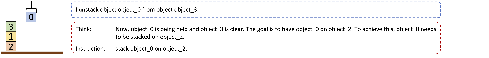
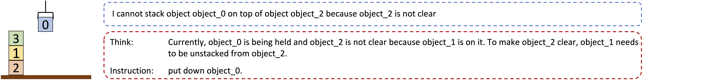
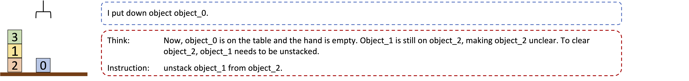
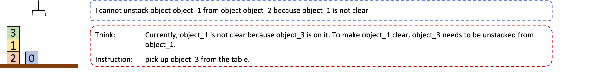
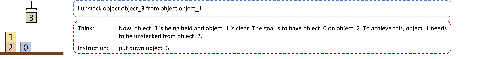
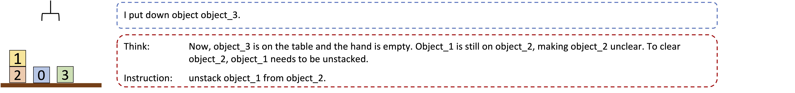

    

**Note on different versions**:  
This website corresponds to the latest version of the AutoPlanBench work. For information about previous versions of the paper and data see Other versions at the end of the website.
APB 2.0: 
* latest version of the dataset
* containing the same 12 domains as APB 1.0 plus a large number of IPC datasets
* NL versions generated using OpenAI's GPT-4o model between Aug-Nov, 2024
* corresponds to the newest version of the paper that will soon be made publicly available
* newest version of the paper _AutoPlanBench_ is called _NL2PDDL_

## AutoPlanBench

We present **AutoPlanBench**, a tool for **automatically converting classical planning benchmarks from PDDL into natural language** planning tasks. PDDL (Planning Domain Definition Language) planning domains are very popular in the classical AI planning research community and available domains differ with respect to a number of characteristics designed to compare the performance of classical planning approaches in different settings.

AutoPlanBench makes these planning tasks available for research on **reasoning and planning with Large Language Models** (LLMs) at a large scale without requiring manual effort or detailed knowledge about PDDL and the domains. We show that the automatically converted planning domains **yield comparable results as manually created** domain descriptions (from Valmeekam et al. 2023: [PlanBench](https://github.com/karthikv792/LLMs-Planning/tree/main/plan-bench)) across different planning domains and LLM planning approaches.
Evaluating LLM planners across a broad range of planning domains, enables us to pinpoint features of planning domains and specific planning problems that make them hard to for LLMs. 

We release the dataset of PDDL domains and problems and their corresponding NL descriptions created by AutoPlanBench / PDDL2NL. Our APB 2.0 dataset consists of:
* 16 custom datasets spanning 12 domains
  * 12 consisting of rather small problems
  * 4 consisting of problems created by systematically scaling up the size of the problems
* 41 IPC datasets spanning 33 domains
  * we include those problem instances for which we could obtain plans using symbolic planners when imposing 30min and 8GB constraints
* one few-shot example per domain in the four different formats required for the Basic and CoT plan generation approaches and Act and ReAct action-choice approaches.

Additionally, we provide the code for converting more PDDL domains and problems into natural-language planning tasks and for automatically generating the few-shot examples, including thoughts. 

In addition to the code for creating NL planning tasks, we provide the implementation of the four different LLM planning approaches for NL input as well as of the Basic and Act approaches on PDDL inputs. 

## PDDL to NL Planning Problems

PDDL planning tasks consist of a domain file and a problem file that defines a specific problem instance with respect to the domain. AutoPlanBench converts both the domain PDDL file and problem files into natural language encodings as illustrated below. The details about the LLM-based conversion methodology can be found in our paper.  

**Blocksworld Domain**

 
Blocksworld Example

 
 

**Visitall Domain**

Visitall Example

 
 

## LLM Action-Choice Mechanisms

### Overall Set-up

* **P-LLM**: does the action selection, i.e. predicts a complete plan / the next action given the domain and problem descriptions
* **L-LLM**: translates natural language output of the P-LLM back to PDDL
* **Simulator**: simulates the world state; outputs an observation for an input action; checks plan validity; determines whether the goal is satisfied

### Tested Approaches

|                 | Plan Generation (Non-interactive)                                                                  | LLM as a policy (Interactive)                                                                                                                                  |
|-----------------|----------------------------------------------------------------------------------------------------|----------------------------------------------------------------------------------------------------------------------------------------------|
| **No Thoughts** | *Basic*   * one complete plan                                                                   | *Act*   * step by step prediction of next action   * observation from the simulator                                                    |
| **Thoughts**    | *CoT*   * Chain-of-Thought (Wei et al. 2022)   * one complete plan   * reasoning thoughts | *ReAct*   * Yao et al. 2023   * step by step prediction of next action   * observation from the simulator   * reasoning thoughts |

  
Full ReAct Example

  
  
  
  
  
  
  
  
  
  
  
  
  
  

## Experiments and Results 

**Metrics** 
* Coverage: The absolute number of correctly solved instances
    * Plan generation: an instance is considered to be solved correctly in case the goal is satisfied after executing all predicted actions from the generated plan
    * Policy: an instance is considered to be solved correctly in case the goal is satisfied within the specified number of steps; the simulator itself takes care of stopping the generation of further actions in that case

**Symbolic Baselines** 
* rnd: selects an action at random from all actions applicable in the current state 
* BrFS: Breadth-first search
* lmc: optimal A* and the LM-Cut heuristic (Helmert et al. 2009)
* ff: satisficing greedy best-first search with FF heuristic (Hoffmann and Nebel, 2001)
We restrict the number of selected actions for rnd to the same number as the maximum number of steps for the LLM policy mechanisms.  
For the other three baselines we impose a memory and time limit of 8 GB and 30 minutes respectively. 

**Results: LLM Action-choice Performance** 

Results on the custom datasets: 

Results on IPC datasets:

## Other Versions

The first version of this paper had been published on Arxiv under the title ["AutoPlanBench: Automatically generating benchmarks for LLM planners from PDDL"](https://arxiv.org/abs/2311.09830). 

A revised version of the paper that has been presented at the [Workshop on Bridging the Gap Between AI Planning and Reinforcement Learning](https://prl-theworkshop.github.io/prl2024-icaps/) (PRL) at ICAPS 2024. The workshop version of the paper can be accessed using their website or the link above.  

## References

M. Helmert and C. Domshlak. Landmarks, critical paths and abstractions: What’s the difference anyway? In *Proceedings of the 19th International Conference on Automated Planning and Scheduling, ICAPS*. AAAI, 2009. 
J. Hoffmann and B. Nebel. The FF planning system: Fast plan generation through heuristic search. 'Journal of Artificial Intelligence Research*, 14:253–302, 2001. 
K. Valmeekam, M. Marquez, A. Olmo, S. Sreedharan, and S. Kambhampati. Planbench: An extensible benchmark for evaluating large language models on planning and reasoning about change. In *Thirty-seventh Conference on Neural Information Processing Systems Datasets and Benchmarks Track*, 2023. 
K. Valmeekam, M. Marquez, S. Sreedharan, and S. Kambhampati. On the planning abilities of large language models - a critical investigation. In *Advances in Neural Information Processing Systems*, pages 75993– 76005. Curran Associates, Inc., 2023. 
J. Wei, X. Wang, D. Schuurmans, M. Bosma, b. ichter, F. Xia, E. Chi, Q. V. Le, and D. Zhou. Chain-of-thought prompting elicits reasoning in large language models. In *Advances in Neural Information Processing Systems*, volume 35, pages 24824–24837. Curran Associates, Inc., 2022. 
S. Yao, J. Zhao, D. Yu, N. Du, I. Shafran, K. R. Narasimhan, and Y. Cao. React: Synergizing reasoning and acting in language models. In *The Eleventh International Conference on Learning Representations*, 2023.

