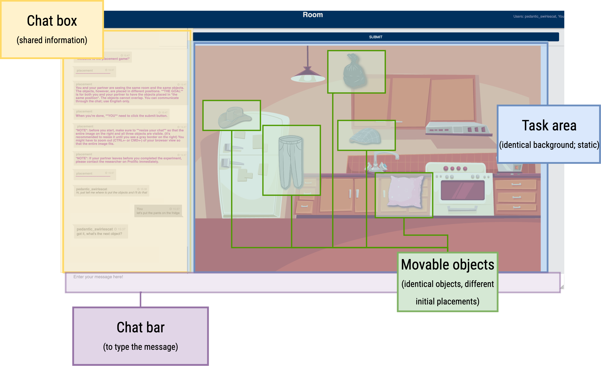

    

## Project overview

Collaboration is an integral part of human dialogue. Typical task-oriented dialogue games assign asymmetric roles to the participants, which limits their ability to elicit naturalistic role-taking in collaboration and its negotiation. We present a novel and simple online setup that **favors balanced collaboration**: a two-player 2D object placement game in which the players must negotiate the goal state themselves. We show empirically that human players exhibit a variety of role distributions, and that balanced collaboration improves task performance. We also present an LLM-based baseline agent which demonstrates that automatic playing of our game is an interesting challenge for artificial systems.

**The website is currently being updated.**

## The Game

We developed a collaborative, 2D object placement game that can be played by two players over the Internet. In each round, the two players see an identical, static background, upon which movable objects have been placed in random positions that are different for the two players. 
The 
 ***goal*** 
of the game is for the players to 
 **place each object in the same position** 
by dragging it with the mouse. Players cannot see each other’s scene; they can only communicate through a chat window. Each pair played two rounds of the game together, allowing us to study how their collaboration strategies evolved with time and exposure. 

  Assets 

    
        Backgrounds:
    
     
    
      
    
        Objects:
    
     
    

  Player view 

     
    
      

 
The game is deployed using **[Slurk](https://github.com/clp-research/slurk)** (Shlangen et al., 2018; Götze et al., 2022), which provided an out-of-the-box frontend, including the separate chat box and stimulus areas, as well as an efficient customizable logging scheme.

  Complete layout overview

     
    
      

The players are scored jointly based on the <b>mean Manhattan distance</b> (0 to 100) between identical objects - the closer the two common objects are placed, the higher the score the pair received.

## Game-playing strategies

In order to analyze the dialogue, we collect human-human data from Prolific participants. We mannually observe different approaches to playing our game, as distinguished by qualitative linguistic features, such as which player is deciding on the conversation trajectory.

Specifically, we observe four distinct strategies:

 

<i>The brackets contain the percentage of total games employing each strategy.</i>

 

 <b>Leader</b> strategy example

TODO

<b>Back and forth</b> example

TODO

<b>Grip loosening</b> example

TODO

<b>Grip tightening</b> example

TODO

 

### Performance results

  
  
   

  <i> A figure breaking down game performance by strategy: <b>left</b> - mean scores in each round for the four collaboration strategies; <b>right</b> - proportion of games that received a bonus (score  &#8805; 99) in either and/or both rounds.* </i>

 

When observing the results, it is clear that the Leader strategy consistently underperforms, with respect to the others - not only are its associated mean scores the lowest, but it has the smallest percentage of games with exceptionally high scores, i.e., fewest bonuses. This illustrates that **our placement game is played most effectively by pairs who take a balanced approach to collaboration.**

<!-- Include MathJax script -->

## Dominance Score

  <!-- Left section with the explanation -->
  

     
    <strong>Terminology:</strong>
     
     

    
For each player in each round of a game, we calculate a <strong>dominance score</strong> ( \(\mathcal{D}\) ) post-hoc, capturing how much one player dominates the way in which gameplay decisions are made. We assign a <strong>high dominance score</strong> to a player with high <em>verbosity</em> and high <em>volume</em>.

    
We calculate the verbosity and volume scores for each player and label them as A (higher volume) and B (the other). Then, we calculate the \(RD\) and use it, along with <em>verbosity</em> to obtain a final \(\mathcal{D}\).

    
<em>(Note that RD is always positive.)</em>

  

  <!-- Right section with the table -->
  

    <table>
      <thead>
        <tr>
          <th>Term</th>
          <th>Equation</th>
          <th>Description</th>
        </tr>
      </thead>
      <tbody>
        <tr>
          <td>verbosity</td>
          <td>/</td>
          <td>Mean message length per player.</td>
        </tr>
        <tr>
          <td>volume</td>
          <td>/</td>
          <td>Percentage of messages sent by each player (0 to 100)</td>
        </tr>
        <tr>
          <td>\(RD\)</td>
          <td>\(\frac{\text{volume}_A - \text{volume}_B}{\text{volume}_A + \text{volume}_B}\)</td>
          <td>Relative volume advantage of player A.</td>
        </tr>
        <tr>
          <td>\(\mathcal{D}_A\)</td>
          <td>\(\text{verbosity}_A \cdot L(RD)\)</td>
          <td>Dominance for player A.</td>
        </tr>
        <tr>
          <td>\(\mathcal{D}_B\)</td>
          <td>\(\text{verbosity}_B \cdot (1 - L(RD))\)</td>
          <td>Dominance score for player B.</td>
        </tr>
        <tr>
          <td>\(L(x)\)</td>
          <td>\(\frac{1}{1+e^{-x}}\)</td>
          <td>Sigmoid function</td>
        </tr>
      </tbody>
    </table>

  

 

  
  Example calculation 

  

     
     

    

      <h4> Example dialogue:</h4>

      Here is a dialogue sample from a pair's second round. The labelling of players (P1, P2) is based on the first round, so here "P2" starts the round (reflecting on their previous round's score).
       

      <table>
        <tr style="background-color: #CCDC; color: black"><td><b>Player</b></td><td> <b>Message </b> </td></tr>
        <tr style="background-color: #CCDC; color: black"><td></td><td></td></tr>
        <tr style="background-color: #FFFFE0; color: black"><td>P2</td><td>great</td></tr>
        <tr style="background-color: #FFB6C1; color: black"><td>P1</td><td>Pillow on couch right side</td></tr>
        <tr style="background-color: #FFB6C1; color: black"><td>P1</td><td>Maybe the rubbish bag under the table?</td></tr>
        <tr style="background-color: #FFFFE0; color: black"><td>P2</td><td>ok</td></tr>
        <tr style="background-color: #FFB6C1; color: black"><td>P1</td><td>The brown hat next to the pillow (centre of couch)</td></tr>
        <tr style="background-color: #FFFFE0; color: black"><td>P2</td><td>ok</td></tr>
        <tr style="background-color: #FFB6C1; color: black"><td>P1</td><td>Okay so my brown hat isn't moving</td></tr>
        <tr style="background-color: #FFFFE0; color: black"><td>P2</td><td>pillow on with couch?</td></tr>
        <tr style="background-color: #FFB6C1; color: black"><td>P1</td><td>Yes, the pillow on the double couch on the right side</td></tr>
        <tr style="background-color: #FFFFE0; color: black"><td>P2</td><td>Blue hat on the other couch</td></tr>
        <tr style="background-color: #FFB6C1; color: black"><td>P1</td><td>Do you have any objects that don't move?</td></tr>
        <tr style="background-color: #FFFFE0; color: black"><td>P2</td><td>the little one</td></tr>
        <tr style="background-color: #FFB6C1; color: black"><td>P1</td><td>Yes</td></tr>
        <tr style="background-color: #FFFFE0; color: black"><td>P2</td><td>pants where?</td></tr>
        <tr style="background-color: #FFFFE0; color: black"><td>P2</td><td>on top of the lamp?</td></tr>
        <tr style="background-color: #FFB6C1; color: black"><td>P1</td><td>Yes. But let's talk about the brown hat. My brown hat isn't moving</td></tr>
        <tr style="background-color: #FFB6C1; color: black"><td>P1</td><td>Brown hat on the centre of the mat</td></tr>
        <tr style="background-color: #FFFFE0; color: black"><td>P2</td><td>ok</td></tr>
        <tr style="background-color: #FFFFE0; color: black"><td>P2</td><td>done?</td></tr>
        <tr style="background-color: #FFB6C1; color: black"><td>P1</td><td>Yep</td></tr>
        <tr style="background-color: #FFFFE0; color: black"><td>P2</td><td>great</td></tr>
      </table>

    

    

       
       

      <h4> Example values </h4>
       

      <table border="1">
        <tr>
          <th></th>
          <th>Player 1 value</th>
          <th>Player 2 value</th>
        </tr>
        <tr>
          <td>number of messages sent</td>
          <td>10</td>
          <td>11</td>
        </tr>
        <tr>
          <td>volume</td>
          <td>47.62</td>
          <td>52.38</td>
        </tr>
        <tr>
          <td>verbosity</td>
          <td>7.5</td>
          <td>2.36</td>
        </tr>
        <tr>
          <td>user label</td>
          <td>B</td>
          <td>A</td>
        </tr>
        <tr>
          <td>\(RD\)</td>
          <td colspan="2" style="text-align: center;"><i>0.048</i></td>
        </tr>
        <tr>
          <td>\(L(x)\)</td>
          <td>0.488</td>
          <td>0.512</td>
        </tr>
        <tr>
          <td>\(\mathcal{D}\)</td>
          <td>3.661</td>
          <td>1.21</td>
        </tr>
        <tr>
          <td>\(\mathcal{D}_{difference}\)</td>
          <td colspan="2" style="text-align: center;"><i>2.451</i></td>
        </tr>
      </table>

       

      <h4> Explanation and interpretation </h4>

       

      In this example round, P1 sends fewer messages than P2 (10 vs. 11), which is reflected in their volume scores. However, P1's messages are longer than P2's (see verbosity). The overall dominance score for each player indicates that player 1 is more dominant, and their stark difference (2.451) indicates that their game would belong to the leader strategy.

       

      Checking the qualitative analysis reveals that this is, indeed, the case, with this round being labelled as "leader" (where P1 gives most instructions, or prompts P2).

    

  

<!-- 
 -->

### The strategies and their dominance scores
---
<!-- 
 -->

 
 

<table border="1" style="width: 100%; border-collapse: collapse;">
  <tr>
    <th style="width: 40%;">Strategy</th>
    <th style="width: 30%;">Round 1</th>
    <th style="width: 30%;">Round 2</th>
  </tr>
  <tr>
    <td><b>leader</b></td>
    <td>1.468</td>
    <td>2.374</td>
  </tr>
  <tr>
    <td><b>back and forth</b></td>
    <td>1.17</td>
    <td>0.981</td>
  </tr>
  <tr>
    <td><b>grip loosening</b></td>
    <td>1.421</td>
    <td>0.988</td>
  </tr>
  <tr>
    <td><b>grip tightening</b></td>
    <td>0.884</td>
    <td>1.696</td>
  </tr>
</table>

<i>Mean dominance score differences</i>

The table to the side showcases the mean dominance score <strong>differences</strong> between the users averaged per round and grouped by strategy. We make the following observations:

<ul>
  <li>the <strong>leader</strong> strategy is characterized by highest values in both rounds, indicating the presence of an overtly dominant user.</li>
  <li>the <strong>back and forth</strong> strategy has a more balanced and smaller difference distribution in both rounds.</li>
  <li>In the case of the two <em>mixed strategies</em>, the R1 and R2 dominance score differences can be seen corresponding to their respective primary strategy counterpart:
    <ul>
      <li>in the <strong>grip loosening</strong> case, R1 corresponds to R1 of the leader strategy, whereas its R2 corresponds to the R2 of the back and forth strategy.</li>
      <li>in the <strong>grip tightening</strong> case, R1 corresponds to the back and forth strategy, whereas R2 matches the leader strategy more closely.</li>
    </ul>
  </li>
</ul>

 

## LLM baseline agent

We build a hybrid reactive baseline agent that plays the game with a human player. The agent is forced into an instruction-follower role by sending the first message asking the human player for instructions.

Upon receiving a message, the system takes the following steps:

<!-- Left section with the table -->

 
<!-- STEPS in table -->

<table class="tg"><thead>
  <tr>
    <th class="tg-baqh">&nbsp;&nbsp;Step&nbsp;&nbsp;&nbsp;</th>
    <th class="tg-baqh">Description</th>
  </tr></thead>
<tbody>
  <tr>
    <td class="tg-0lax">Step 1</td>
    <td class="tg-0lax">verify if the message contains instructions</td>
  </tr>
  <tr>
    <td class="tg-0lax">Step 2</td>
    <td class="tg-0lax">- parse the message - for each group <small>(target, reference, direction)</small>: &nbsp;&nbsp;&nbsp;&nbsp;1. extract them &nbsp;&nbsp;&nbsp;&nbsp;2. map the term to one of the predefined  &nbsp;&nbsp;&nbsp;&nbsp;allowed terms </td>
  </tr>
  <tr>
    <td class="tg-0lax">Step 3</td>
    <td class="tg-0lax">change the position of the objects according to Step 2 based on predefined constraints</td>
  </tr>
</tbody></table>

<i>The steps that the system takes upon receiving each message from the human player. Steps 1 and 2 are LLM-based, while Step 3 is rule-based.</i>

 
 
<!-- ARCHITECTURE -->

  

  <i>The architecture of the reactive baseline.</i>

### The steps in detail

#### Step 1 & 2

In order to complete these steps, we use LLMs with few shot learning. 

The prompts we use are as follows:

 <b>Step 1 prompt</b> <i>(Checking if a message contains instructions)</i> 

 

<pre style="font-family: 'Courier New', Courier, monospace; white-space: pre-wrap; padding: 5px;">
You are playing a game with another player in which you have to follow their instructions about where to put certain objects. I will give you a message and I want you to tell me if it contains a set of instructions. Don't provide explanation, just give me the output (True or False). Examples:
[user 1]: place the lamp on the fridge
[you]: True

[user 1]: can you put the knife in the drawer?
[you]: True

[user 1]: do you have a toaster?
[you]: False

[user 1]: what objects do you have?
[you]: False

[user 1']: let's place the pan on top of the lamp
[you]: True

[user 1]: put hat on sink
[you]: True

[user 1]: lamp on toilet
[you]: True
</pre>

 <b>Step 2 prompt #1</b> <i>(Extracting and mapping the target and reference objects)</i>

<pre style="font-family: 'Courier New', Courier, monospace; white-space: pre-wrap; padding: 5px;">
I will give you a set of instructions and I want you to extract two things: one, the object that should be moved. Then, I want you to compare it to the following four words and return the one it is most close to. The objects are: garbage, cowboy, cap, pants, pillow. Next, I want you to extract the location where the object should be placed. Then, match the output place with one of the possible places: fridge, counter, toaster, lamp, stove, oven, sink. Don't provide explanation, just give me the output. For example:

[user 1]: put the pillow to the right of the fridge
[you]: pillow, fridge

[user 1]: put the jeans on the stove
[you]: pants, stove

[user 1]: let's place the cushion on the ceiling light
[you]: pillow, lamp

[user 1]: place the garbagebag in the upper right corner of the counter
[you]: garbage, counter

[user 1]: cowboy hat to the left of the water faucet
[you]: cowboy, sink

[user 1]: the other hat on the right behind the pants
[you]: cap, toaster

[user 1]: garbage bag on top of lamp stand
[you]: garbage, lamp

[user 1]: let's place the blue hat on the toaster
[you]: cap, toaster

[user 1]: put peaky blinders hat in the oven
[you]: cap, oven
</pre>

 <b>Step 2 prompt #2</b> <i>(Extracting and mapping direction)</i>

 

<pre style="font-family: 'Courier New', Courier, monospace; white-space: pre-wrap; padding: 5px;">
I will give you a set of instructions and I want you to extract the key spatial word or phrase. Then, I want you to compare it to the following four words and return the one it is most close to. The words are: above, below, next to, on. Don't provide explanation, just give me the output. For example:

[user 1]: put the knife to the right of the fridge
[you]: next to

[user 1]: put the pan above the oven
[you]: above

[user 1]: place the toilet paper in the upper right corner of the cupboard
[you]: on

[user 1]: cowboy hat to the left of the water faucet
[you]: next to

[user 1]: the cowboy hat on the right behind the pants
[you]: next to

[user 1]: pillow under the sink
[you]: below

[user 1]: garbage bag on top of lamp stand
[you]: above
</pre>

 

#### Step 3: movement rule set

In order to decide on new placements of the target object, the system uses predefined *(x, y)* coordinates of landmark (static) objects and a set of direction representations.

  
  
   
  For <i>r</i> referring to the stataic reference object, and <i>t</i> referring to the movable target object.

 

### LLM results

The results of the LLM round indicate that:

* even a simple baseline agent can achieve results close to those of human pairs (see mean score)
* the dominance metric is an effective way of capturing the discrepancy in conversational steering within different strategy groups. Since the LLM agent is forced into an instruction-following role, all the games in this batch will correspond to the leader strategy, which is reflected in the mean dominance score difference shown in the results.

The results can be found below.

 

<h4>Dominance score:</h4>

<table style="width: 100%; border-collapse: collapse; background-color: #f0f0f0; color: black; margin-bottom: 20px;">
  <tr style="background-color: #dcdcdc; color: #808080;">
    <th style="padding: 8px; text-align: left;"><strong>Strategy</strong></th>
    <th style="padding: 8px; text-align: center;"><strong>Round 1</strong></th>
    <th style="padding: 8px; text-align: center;"><strong>Round 2</strong></th>
  </tr>
  <tr style="background-color: #f0f0f0; color: #808080;">
    <td style="padding: 8px; text-align: left;"><strong>leader</strong></td>
    <td style="padding: 8px; text-align: center;">1.468</td>
    <td style="padding: 8px; text-align: center;">2.374</td>
  </tr>
  <tr style="background-color: #f0f0f0; color: #808080;">
    <td style="padding: 8px; text-align: left;"><strong>back and forth</strong></td>
    <td style="padding: 8px; text-align: center;">1.17</td>
    <td style="padding: 8px; text-align: center;">0.981</td>
  </tr>
  <tr style="background-color: #f0f0f0; color: #808080;">
    <td style="padding: 8px; text-align: left;"><strong>grip loosening</strong></td>
    <td style="padding: 8px; text-align: center;">1.421</td>
    <td style="padding: 8px; text-align: center;">0.988</td>
  </tr>
  <tr style="background-color: #f0f0f0; color: #808080;">
    <td style="padding: 8px; text-align: left;"><strong>grip tightening</strong></td>
    <td style="padding: 8px; text-align: center;">0.884</td>
    <td style="padding: 8px; text-align: center;">1.696</td>
  </tr>
  <tr style="background-color: #ffffff; border: 2px solid #808080;">
    <td style="padding: 8px; text-align: left;"><strong>LLM</strong></td>
    <td style="padding: 8px; text-align: center;">2.02</td>
    <td style="padding: 8px; text-align: center;">N/A</td>
  </tr>
</table>

"

## References

Schlangen, D., Diekmann, T., Ilinykh, N., & Zarrieß, S. (2018). slurk–a lightweight interaction server for dialogue experiments and data collection. In *Proceedings of the 22nd Workshop on the Semantics and Pragmatics of Dialogue (AixDial/semdial 2018)*.

Götze, J., Paetzel-Prüsmann, M., Liermann, W., Diekmann, T., & Schlangen, D. (2022). The slurk interaction server framework: Better data for better dialog models. In *Proceedings of the Thirteenth Language Resources and Evaluation Conference* (pp. 4069–4078). Marseille, France: European Language Resources Association.
