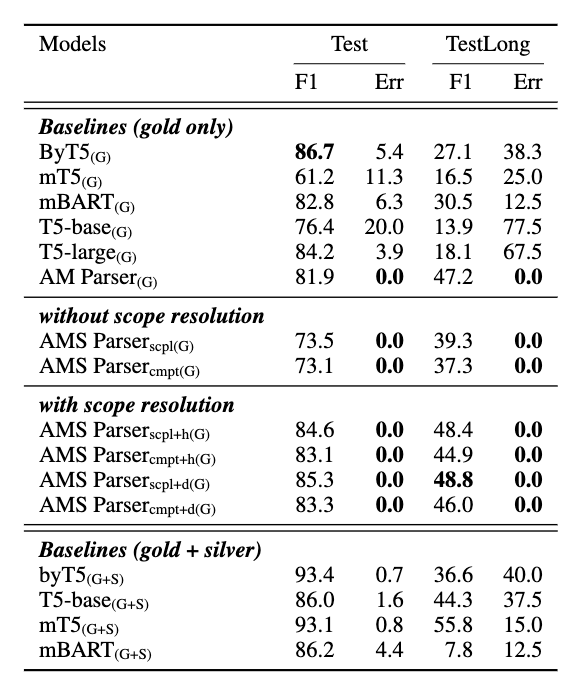
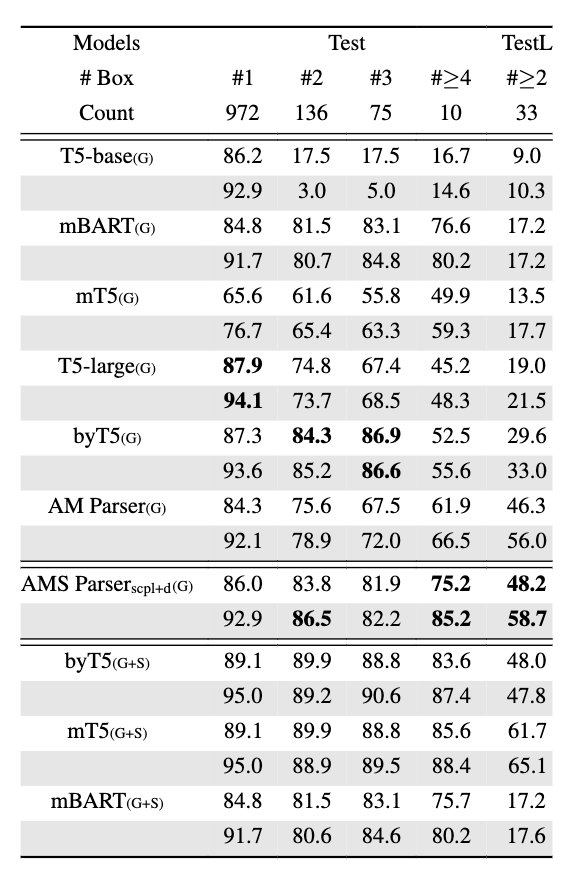

    

## Abstract

Discourse Representation Theory (DRT) distinguishes itself from other semantic representation frameworks by its ability to model complex semantic and discourse phenomena through structural nesting and variable binding. 
While seq2seq models hold the state of the art on DRT parsing, their accuracy degrades with the complexity of the sentence, and they sometimes struggle to produce well-formed DRT representations.
We introduce the **AMS parser**, a compositional, neurosymbolic semantic parser for DRT. It rests on a novel mechanism for predicting **quantifier scope**.
We show that the AMS parser reliably produces well-formed outputs and performs well on DRT parsing, especially on complex sentences.

## AMS Parser

We introduce the **AMS parser**, an accurate compositional DRT parser. The AMS parser extends the AM parser, which predicts meaning representations compositionally and has achieved high accuracy across a range of sembanks. The AM parser by itself struggles to predict structural nesting in DRT. The key challenge is to predict scope because differences in scope assignment affect the represented meaning significantly (as shown in the figure below).

We proposed a novel mechanism for predicting scope assignments in DRT parsing. We train a dependency parser to predict scope relations between word tokens and project this information into the DRT representation using word-to-box alignments. 

By combining it with the compositional AM parser, the AMS parser outperforms existing DRT parsers trained on the same dataset, especially for complex sentences. It also avoids the prediction of ill-formed DRGs that plague other models. The prediction of scope information has been a long-standing challenge in computational semantics; our dependency parsing mechanism achieves very high accuracy on this task.

Additionally, compared to other models trained on gold data, the AMS parser excels at maintaining its accuracy as the DRGs grow more complex.

 

<!-- 

 -->

