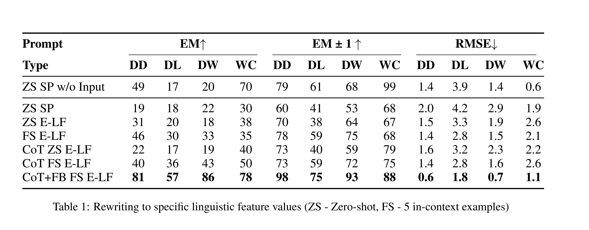
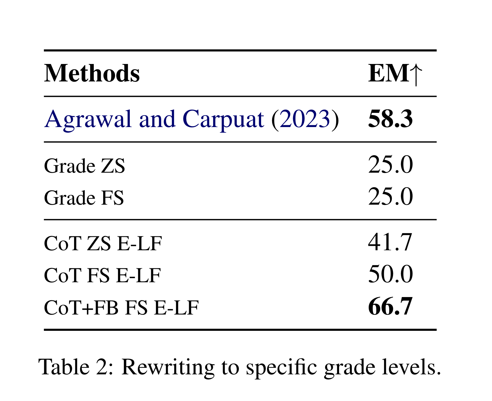

[//]: # (## Abstract)

[//]: # ()
[//]: # ([//]: # &#40;Imagine a world where text is seamlessly rewritten to precise linguistic specifications, perfectly tailored to your reader's needs, without extensive training data. &#41;)
[//]: # ([//]: # &#40;Our method, using in-context learning with feedback, performs accurate rewrites and matches state-of-the-art results for rewriting sentences to specified school grade levels.&#41;)
[//]: # ()
[//]: # ()
[//]: # (Effortlessly achieving precise linguistic specifications in text rewriting, tailored perfectly to the reader’s needs, without extensive training data. )

[//]: # (Our method, using in-context learning with feedback, performs accurate rewrites and matches state-of-the-art results for rewriting sentences to specified school grade levels.)

    
     
    <b>Figure 1: Rewriting an input sentence to dependency depth 4 through prompting.</b>

# Overview

We explore the task of rewriting texts to enhance comprehension for specific readers by employing *Controllable Text Generation with Linguistic Features (CTG-LFs)*. This approach utilizes a language model to adjust input texts according to predetermined linguistic specifications, such as syntactic complexity, to cater to the cognitive abilities of individual readers. Previous methods have relied on fine-tuning models with extensive parallel data, often limiting application to certain target audiences (grade levels) or languages. Our work investigates a novel implementation of CTG-LFs using *in-context learning (ICL)*, which bypasses the need for a large corpus by leveraging examples within the model's context to guide text transformation.

We present a new methodology that refines the in-context learning with CoT and feedback approach to perform reader-specific text modifications based on nontrivial linguistic features like dependency depth, length, number of difficult words in a sentence and sentence length. We show that our method performs accurate rewrites, with e.g. 81% of test sentences being rewritten to the exact requested dependency depth. 
Furthermore, by integrating our CTG-LFs model with a model that predicts linguistic feature values for desired target grade level, we develop an end-to-end system capable of rewriting sentences to match a desired (school) grade level. Our system outperforms previous methods, achieving effective reader-specific rewrites using only five in-context examples, thus eliminating the need for extensive training corpora. Our findings highlight the potential of ICL in expanding the applicability of CTG-LFs to diverse reader groups and languages, enhancing personalized text comprehension.

[//]: # (Our results demonstrate that our ICL-based model achieves a high accuracy in rewriting sentences to specific linguistic features, with 81% of test sentences rewritten to the exact requested dependency depth. Furthermore, by integrating our CTG-LFs model with a model that predicts linguistic feature values, we develop an end-to-end system capable of rewriting sentences to match a desired &#40;school&#41; grade level. This system outperforms previous methods, achieving effective reader-specific rewrites using only five in-context examples, thus eliminating the need for extensive training corpora. Our findings highlight the potential of ICL in expanding the applicability of CTG-LFs to diverse reader groups and languages, enhancing personalized text comprehension.)

[//]: # (Understanding and generating text that aligns with the cognitive abilities of individual readers is a complex task influenced by various factors such as working memory capacity, lexical access speed, and prior knowledge. )

[//]: # (This paper investigates the challenge of rewriting input text to enhance its comprehensibility for specific readers. )

[//]: # (Traditional approaches in *controllable text generation with linguistic features* &#40;CTG-LFs&#41; Martin et al. &#40;2020, 2022&#41; involve concatenating an input sentence with specified linguistic features like )

[//]: # (permissible syntactic complexity, enabling a *large language model* &#40;LLM&#41; to generate the desired output. )

[//]: # (Agrawal and Carpuat &#40;2023&#41;, have effectively demonstrated this by approximating readers' cognitive abilities using school grade levels, which can be annotated in corpora or calculated automatically.)

[//]: # ()
[//]: # (However, existing CTG-LF methods typically rely on fine-tuning pretrained language models, which necessitates a substantial amount of parallel training data to )

[//]: # (pair original sentences with their reader-specific rewrites. This approach proves impractical for categories of readers other than school grade levels or )

[//]: # (for languages other than English due to data sparsity. In contrast, the method presented in this paper leverages in-context learning &#40;ICL&#41; rather than fine-tuning,)

[//]: # (making it applicable even when data is sparse. )

[//]: # (Our proposed method demonstrates accurate rewrites and achieves state-of-the-art performance in rewriting sentences to specified school grade levels using only five in-context examples instead of an extensive training corpus. )

[//]: # (This novel approach to CTG-LF with ICL not only addresses data limitations but also enhances flexibility and adaptability in generating reader-specific text adaptations.)

# Method

Our goal is to build a model that takes a sentence *w* and a specification of a reader as input and rewrites *w* to be optimal for that type of reader. 
We will approximate the specification of a reader with *school grade levels*, which indicate a level of text complexity that is suitable for students of a certain grade in an American school. 

We split the process of rewriting w for a target grade level into two steps:

1. Step-1: Predicting Linguistic Feature values for *w* according to the given target grade level
2. Step-2 (our main contribution): Rewrite *w* to match the predicted feature values via CTG-LF with ICL.

[//]: # (**Predicting Linguistic Features**)

### Step-1: Feature Value Predictor 
A model that predicts values for the features given the input sentence *w* and target grade level. 

[//]: # (    )

    
     
    <b>Figure 2: Feature value predictor based on decision tree classifier. (SG - Source Grade and TG - desired Target Grade) </b>

 
We tailor text complexity and content using established linguistic features that are
known to impact text comprehension and cognitive load. Those features are:
- **Maximum Dependency Tree Depth (DD)**: The longest path from root to leaf.
- **Maximum Dependency Tree Length (DL)**: Maximum word distance between parent and child.
- **no. of Difficult Words (DW)**: Number of words that are not in the Dale-Challs (Chall and
Dale, 1995) easy word list (3000 words typically understood by 4th-grade students in the U.S.).
- **Word Count (WC)**: Number of words in a sentence.

[//]: # (Particularly, dependency depth and length have been recognized in existing literature for their significant effect on processing difficulty Nicenboim et al. &#40;2015&#41;; Gibson &#40;1998&#41;; van Schijndel et al. &#40;2013&#41;.)

 
Example Explanation of Linguistic Feature Value Calculation

### Step-2: CTG-LF with ICL 

    
     
    <b>Figure 3: CTG-LF workflow (ZS - Zero-shot, FS - Few-shot) </b>

 
Our approach combines two core ideas. First, we include an analysis of the input sentence in the prompt and ask the LLM to generate an analysis
of the output sentence, followed by the output sentence itself. With an “analysis”, we mean a representation of the sentence that makes a feature value
explicit; the analysis takes the role of a thought in CoT reasoning (Wei et al., 2022). For DD and DL, we use linearized dependency trees in which each word is annotated with its depth or length; Fig. 1 shows an example for DD. 
For DW, the analysis is the list of difficult words in the sentence; for WC, it is simply the list of words in the sentence.
Analyses allow us to incorporate explicit syntactic information into the prompting process; note, however, that the output analysis is generated by the LLM and not by a parser.

Second, we equip our model with a feedback mechanism (Shinn et al., 2024): after each LLM output, we run an external validator on the generated output sentence to determine its true feature
values; e.g. a dependency parser for DD. If the feature value differs from the requested one, the LLM
is called again, after amending the prompt with the true analysis of the generated output sentence and a feedback message such as “The maximum dependency depth of the rewritten sentence is 5; please revise it with a depth of 4.” All previous LLM
queries for this sentence, with the LLM response and the judgments of the parser, are included in the prompt. We permit up to 10 iterations of this feedback loop; if none yield the correct feature value,
we return the output of the final iteration.

Values for multiple features can be specified at
the same time by concatenating the descriptions
and analyses for all the features.

# Evaluation
First we evaluate the ability of our CTG model to rewrite to the requested feature values in isolation, and then the ability of the combined model to
rewrite to a requested grade level (varing from 1 to 12).
We use GPT-4o (version gpt-4o-2024-05-13) as our LLM for all ICL experiments. 

**Dataset:** We utilize the WikiLarge Zhang and Lapata (2017) text simplification datasets, which consists of automatically aligned complex-simple sentence pairs from English Wikipedia (EW) and Simple English Wikipedia (SEW). This dataset provides a practical foundation for our research, simplification studies often adjust each input sentence’s complexity to approximate different grade level(s). 

[//]: # (We evaluate first the ability of our CTG model to rewrite to the requested feature values in isolation, and then the ability of the combined model to rewrite to a requested grade level.)

### CTG to Linguistic Features
Table 1 shows that we rewrite every source sentence in the test set with respect to the gold feature values of its corresponding target sentence, using our CTG-LF model.
Our proposed method exhibited a high degree of accuracy in rewriting sentences to meet specific linguistic feature values, such as dependency depth, and the number of difficult words. 
The combination of ICL and a feedback mechanism allowed for precise control over the features, significantly outperforming simpler prompting techniques.

[//]: # (We rewrite every source sentence in the test set with respect to the gold feature values of its corresponding target sentence, using our CTG-LF model.)

**Metrics**  
* EM: The percentage of sentences where the rewritten feature values exactly matched the requested gold feature values.
* EM ±1:  The percentage of sentences where the rewritten feature values were within one unit of the requested gold feature values.
* RMSE:  The average deviation of the feature values from the gold values.

[//]: # (#### Tested Approaches)
**Tested Prompt Types**

* **ZS SP w/o Input**: Simple prompt to generate any sentence with the given feature values; there is no input sentence to be rewritten, similar to Sun et al. (2023).  
    

        
 
            Example Prompt and LLM response:
        

        

        <pre style="font-family: 'Courier New', Courier, monospace; white-space: pre-wrap; padding: 5px;">
  User: Generate a sentence with a maximum depth of the dependency tree of exactly 5.

  Assistant:  Sure, here’s a sentence with a dependency tree depth of exactly 5: "The cat that the boy who lives next door adopted last week is very playful." In this sentence, the depth of the dependency tree is 5, as follows: 1. "is" (root) 2. "playful" (complement of "is") 3. "cat" (subject of "is") 4. "that" (relative pronoun modifying "cat") 5. "adopted" (verb in the relative clause modifying "cat")6. "boy" (subject of "adopted") 7. "who" (relative pronoun modifying "boy") 8. "lives" (verb in the relative clause modifying "boy") 9. "next door" (prepositional phrase modifying "lives") 10. "last week" (adverbial phrase modifying "adopted")The longest path from the root "is" to a leaf node (e.g., "door" or "week") involves 5 steps. 
  </pre>
  

  

* **ZS SP**:  Simple prompt to rewrite a given sentence with the given feature values.
    

        
 
            Example Prompt and LLM response:
        

        

        <pre style="font-family: 'Courier New', Courier, monospace; white-space: pre-wrap; padding: 5px;">
  User:  Input Text: Mar del Plata is an Argentine city located on the coast of the Atlantic Ocean, 400 k south of Buenos Aires. 
  Rewrite the input text to maintain its original meaning while strictly adhering to a maximum depth of the dependency tree of exactly 5.

  Assistant:  Mar del Plata is a city in Argentina on the Atlantic coast, 400 km south of Buenos Aires. 
  </pre>
  

  

  
* **ZS E-LF**:  Prompt includes a detailed definition of the feature and an analysis of the input sentence. Then ask to rewrite to new specficed feature values.
    

        
 
            Example Prompt and LLM response:
        

        

        <pre style="font-family: 'Courier New', Courier, monospace; white-space: pre-wrap; padding: 5px;">
  System: You are an expert in text adaptation, skilled at meticulously rewriting texts to align with requested linguistic features while preserving the original meaning. Your task is to rewrite the provided Input Text to maintain its original meaning while strictly adhering to the specified maximum depth of the dependency tree. Here, maximum depth of the dependency tree indicates the largest number of hierarchical levels from the root word (typically the main verb) to the deepest node in the sentence, indicating the most complex relationship chain in the grammatical structure. If the rewrite requires multiple sentences, each must conform to the specified maximum dependency tree depth. Phrasing or structure modifications are permissible, as long as the essential meaning is retained. Ensure each sentence rigorously conforms to the specified constraints, utilizing your extensive knowledge in linguistics, without fabricating any responses. Always output all Rewritten sentence(s) within one curly brace.

  User: Input Text: Mar del Plata is an Argentine city located  on the coast of the Atlantic Ocean, 400 k south of Buenos Aires. 
Input text’s Depth-Indexed Linearized Dependency Tree: [’(0, is)(1, Plata)(2, Mar) (2, del) (1, city)(2, an) (2, Argentine) (2, located)(3, on)(4, coast)(5, the) (5, of)(6, Ocean)(7, the) (7, Atlantic) (2, ,) (2, south)(3, 400) (3, k) (3, of)(4, Aires)(5, Buenos) (1, .)’]. 
The maximum depth of dependency tree of the input text, as determined by the highest value in its "Depth-Indexed Linearized Dependency Tree" is 7. The input text currently holds a maximum dependency depth of 7.
Rewrite the input text to maintain its original meaning while strictly adhering to a maximum depth of the dependency tree of exactly 5.
Always output all Rewritten sentence(s) within curly braces.

  Assistant:  {Mar del Plata is a city in Argentina. It is on the coast of the Atlantic Ocean, 400 km south of Buenos Aires.} 
  </pre>
  

  

* **FS E-LF**:  5 in-context examples with E-LF. 
    

        
 
            Example Prompt and LLM response:
        

        

        <pre style="font-family: 'Courier New', Courier, monospace; white-space: pre-wrap; padding: 5px;">
  System: You are an expert in text adaptation, skilled at meticulously rewriting texts to align with requested linguistic features while preserving the original meaning. Your task is to rewrite the provided Input Text to maintain its original meaning while strictly adhering to the specified maximum depth of the dependency tree. Here, maximum depth of the dependency tree indicates the largest number of hierarchical levels from the root word (typically the main verb) to the deepest node in the sentence, indicating the most complex relationship chain in the grammatical structure. If the rewrite requires multiple sentences, each must conform to the specified maximum dependency tree depth. Phrasing or structure modifications are permissible, as long as the essential meaning is retained. Ensure each sentence rigorously conforms to the specified constraints, utilizing your extensive knowledge in linguistics, without fabricating any responses. Always output all Rewritten sentence(s) within one curly brace.
  
  
  User: "Input Text: 1385 - Union of Krewo - a personal union that brought Grand Duke of Lithuania Jogaila to Polish throne; 
  Input text’s Depth-Indexed Linearized Dependency Tree: [’(0, Union)(1, 1385) (1, -) (1, of)(2, Krewo) (1, -) (1, union)(2, a) (2, personal) (2, brought)(3, that) (3, Duke)(4, Grand) (4, of)(5, Jogaila)(6, Lithuania) (3, to)(4, throne)(5, Polish) (1, ;)’]. 
  The maximum depth of dependency tree of the input text, as determined by the highest value in its "Depth-Indexed Linearized Dependency Tree" is 6. The input text currently holds a maximum dependency depth of 6.
  Rewrite the input text to maintain its original meaning while strictly adhering to a maximum depth of the dependency tree of exactly 4.
  Always output all Rewritten sentence(s) within curly braces.
  Assistant:  Rewritten sentence(s): {1385 - Union of Krewo - a personal union;}
  
  User: In-context example-2 input
  Assistant: In-context example-2 output
  User: In-context example input-3
  Assistant: In-context example-3 input
  User: In-context example-4 output
  Assistant: In-context example-4 input
  User: In-context example-5 output
  Assistant: In-context example-5 input

  User: Input Text: Mar del Plata is an Argentine city located  on the coast of the Atlantic Ocean, 400 k south of Buenos Aires. 
Input text’s Depth-Indexed Linearized Dependency Tree: [’(0, is)(1, Plata)(2, Mar) (2, del) (1, city)(2, an) (2, Argentine) (2, located)(3, on)(4, coast)(5, the) (5, of)(6, Ocean)(7, the) (7, Atlantic) (2, ,) (2, south)(3, 400) (3, k) (3, of)(4, Aires)(5, Buenos) (1, .)’]. 
The maximum depth of dependency tree of the input text, as determined by the highest value in its "Depth-Indexed Linearized Dependency Tree" is 7. The input text currently holds a maximum dependency depth of 7.
Rewrite the input text to maintain its original meaning while strictly adhering to a maximum depth of the dependency tree of exactly 5.
Always output all Rewritten sentence(s) within curly braces.

  Assistant: Rewritten sentence(s): {Mar del Plata is an Argentine city on the Atlantic coast, 400 km south of Buenos Aires.} 
  </pre>
  

  

* **CoT ZS E-LF**:  We let the model to generate the output reasons step-by-step and includes an analysis of the output sentence, following with rewritten sentences. 
  

        
 
            Example Prompt and LLM response:
        

        

        <pre style="font-family: 'Courier New', Courier, monospace; white-space: pre-wrap; padding: 5px;">
  System: You are an expert in text adaptation, skilled at meticulously rewriting texts to align with requested linguistic features while preserving the original meaning. Your task is to rewrite the provided Input Text to maintain its original meaning while strictly adhering to the specified maximum depth of the dependency tree. Here, maximum depth of the dependency tree indicates the largest number of hierarchical levels from the root word (typically the main verb) to the deepest node in the sentence, indicating the most complex relationship chain in the grammatical structure. If the rewrite requires multiple sentences, each must conform to the specified maximum dependency tree depth. Phrasing or structure modifications are permissible, as long as the essential meaning is retained. Ensure each sentence rigorously conforms to the specified constraints, utilizing your extensive knowledge in linguistics, without fabricating any responses. Always output all Rewritten sentence(s) within one curly brace.
  
  User: Input Text: Mar del Plata is an Argentine city located  on the coast of the Atlantic Ocean, 400 k south of Buenos Aires. 
  Input text’s Depth-Indexed Linearized Dependency Tree: [’(0, is)(1, Plata)(2, Mar) (2, del) (1, city)(2, an) (2, Argentine) (2, located)(3, on)(4, coast)(5, the) (5, of)(6, Ocean)(7, the) (7, Atlantic) (2, ,) (2, south)(3, 400) (3, k) (3, of)(4, Aires)(5, Buenos) (1, .)’]. 
  The maximum depth of dependency tree of the input text, as determined by the highest value in its "Depth-Indexed Linearized Dependency Tree" is 7. The input text currently holds a maximum dependency depth of 7.
  Rewrite the input text to maintain its original meaning while strictly adhering to a maximum depth of the dependency tree of exactly 5.
  Please note, that if the initial rewrite does not meet these specific requirements, you are encouraged to modify and regenerate the output until the criteria are satisfactorily met. Let’s think through this step by step. Solve each step and explain how you arrived at your answer. Always output all the rewritten sentence(s) within one curly brace.
  
  Assistant:  To rewrite the input text while adhering to a maximum dependency tree depth of 5, we need to simplify the sentence structure. The original sentence has a depth of 7, so we will break it down into simpler sentences while retaining the original meaning.
  1. Identify the main components of the sentence:
  - Mar del Plata (subject)
  - is (verb) - an Argentine city (predicate)
  - located on the coast of the Atlantic Ocean (additional information)
  - 400 km south of Buenos Aires (additional information)
  2. Simplify and break down the sentence:
  - Mar del Plata is an Argentine city.
  - It is located on the coast of the Atlantic Ocean.
  - It is 400 km south of Buenos Aires.
  3. Ensure each sentence has a maximum dependency tree depth of 5:
  - "Mar del Plata is an Argentine city." (Depth: 3)
  - "It is located on the coast of the Atlantic Ocean." (Depth: 5)
  - "It is 400 km south of Buenos Aires." (Depth: 5)
  By breaking the original sentence into three simpler sentences, we ensure that each sentence adheres to the maximum depth of 5.
  Here is the rewritten text: {Mar del Plata is an Argentine city. It is located on the coast of the Atlantic Ocean. It is 400 km south of Buenos Aires.} 
  </pre>
  

  

* **CoT FS E-LF**:  5 in-context examples, where examples demonstrated with output reasons step-by-step and includes an analysis of the output sentence, following with rewritten sentences
  

        
 
            Example Prompt and LLM response:
        

        

        <pre style="font-family: 'Courier New', Courier, monospace; white-space: pre-wrap; padding: 5px;">
  System: You are an expert in text adaptation, skilled at meticulously rewriting texts to align with requested linguistic features while preserving the original meaning. Your task is to rewrite the provided Input Text to maintain its original meaning while strictly adhering to the specified maximum depth of the dependency tree. Here, maximum depth of the dependency tree indicates the largest number of hierarchical levels from the root word (typically the main verb) to the deepest node in the sentence, indicating the most complex relationship chain in the grammatical structure. If the rewrite requires multiple sentences, each must conform to the specified maximum dependency tree depth. Phrasing or structure modifications are permissible, as long as the essential meaning is retained. Ensure each sentence rigorously conforms to the specified constraints, utilizing your extensive knowledge in linguistics, without fabricating any responses. Always output all Rewritten sentence(s) within one curly brace.
  
  User: "Input Text: 1385 - Union of Krewo - a personal union that brought Grand Duke of Lithuania Jogaila to Polish throne; 
  Input text’s Depth-Indexed Linearized Dependency Tree: [’(0, Union)(1, 1385) (1, -) (1, of)(2, Krewo) (1, -) (1, union)(2, a) (2, personal) (2, brought)(3, that) (3, Duke)(4, Grand) (4, of)(5, Jogaila)(6, Lithuania) (3, to)(4, throne)(5, Polish) (1, ;)’]. 
  The maximum depth of dependency tree of the input text, as determined by the highest value in its "Depth-Indexed Linearized Dependency Tree" is 6. The input text currently holds a maximum dependency depth of 6.
  Rewrite the input text to maintain its original meaning while strictly adhering to a maximum depth of the dependency tree of exactly 4.
  Please note, that if the initial rewrite does not meet these specific requirements, you are encouraged to modify and regenerate the output until the criteria are satisfactorily met. Let’s think through this step by step. Solve each step and explain how you arrived at your answer. Always output all the rewritten sentence(s) within one curly brace.
  Assistant:  Summary of compliance with rewriting criteria:
  Rewritten sentence’s Depth-Indexed Linearized Dependency Tree: [’(0, Union)(1, 1385) (1, -) (1, of)(2, Krewo)(3, -) (3, union)(4, a) (4, personal) (1, ;)’].
  The maximum depth of the dependency tree for the rewritten sentence, as measured by its "Depth-Indexed Linearized Dependency Tree" is 4. This meets the requested value of exactly 4.
  Rewritten sentence(s): {1385 - Union of Krewo - a personal union;}
  
  User: In-context example-2 input
  Assistant: In-context example-2 output
  User: In-context example input-3
  Assistant: In-context example-3 input
  User: In-context example-4 output
  Assistant: In-context example-4 input
  User: In-context example-5 output
  Assistant: In-context example-5 input

  User: Input Text: Mar del Plata is an Argentine city located  on the coast of the Atlantic Ocean, 400 k south of Buenos Aires. 
  Input text’s Depth-Indexed Linearized Dependency Tree: [’(0, is)(1, Plata)(2, Mar) (2, del) (1, city)(2, an) (2, Argentine) (2, located)(3, on)(4, coast)(5, the) (5, of)(6, Ocean)(7, the) (7, Atlantic) (2, ,) (2, south)(3, 400) (3, k) (3, of)(4, Aires)(5, Buenos) (1, .)’]. 
  The maximum depth of dependency tree of the input text, as determined by the highest value in its "Depth-Indexed Linearized Dependency Tree" is 7. The input text currently holds a maximum dependency depth of 7.
  Rewrite the input text to maintain its original meaning while strictly adhering to a maximum depth of the dependency tree of exactly 5.
  Please note, that if the initial rewrite does not meet these specific requirements, you are encouraged to modify and regenerate the output until the criteria are satisfactorily met. Let’s think through this step by step. Solve each step and explain how you arrived at your answer. Always output all the rewritten sentence(s) within one curly brace.
  
  Assistant: Summary of compliance with rewriting criteria:
  Rewritten sentence’s Depth-Indexed Linearized Dependency Tree: [’(0, is)(1, Plata)(2, Mar) (2, del) (1, city)(2, an) (2, Argentine) (2, on)(3, coast)(4, the) (4, of)(5, Ocean)(5, Atlantic) (2, ,) (2, south)(3, 400) (3, k) (3, of)(4, Aires)(5, Buenos) (1, .)’].
  The maximum depth of the dependency tree for the rewritten sentence, as measured by its "Depth-Indexed Linearized Dependency Tree," is 5. This meets the requested value of exactly 5.
  Rewritten sentence(s): {Mar del Plata is an Argentine city on the coast of the Atlantic Ocean, 400 k south of Buenos Aires.} 
  </pre>
  

  

  
* **CoT+FB FS E-LF**:  Here, we use a feedback loop with an external validator.  
  

        
 
            Example Prompt and LLM response:
        

        

        <pre style="font-family: 'Courier New', Courier, monospace; white-space: pre-wrap; padding: 5px;">
  System: You are an expert in text adaptation, skilled at meticulously rewriting texts to align with requested linguistic features while preserving the original meaning. Your task is to rewrite the provided Input Text to maintain its original meaning while strictly adhering to the specified maximum depth of the dependency tree. Here, maximum depth of the dependency tree indicates the largest number of hierarchical levels from the root word (typically the main verb) to the deepest node in the sentence, indicating the most complex relationship chain in the grammatical structure. If the rewrite requires multiple sentences, each must conform to the specified maximum dependency tree depth. Phrasing or structure modifications are permissible, as long as the essential meaning is retained. Ensure each sentence rigorously conforms to the specified constraints, utilizing your extensive knowledge in linguistics, without fabricating any responses. Always output all Rewritten sentence(s) within one curly brace.
  
  User: In-context example-1 input
  Assistant: In-context example-1 output
  User: In-context example-2 input
  Assistant: In-context example-2 output
  User: In-context example input-3
  Assistant: In-context example-3 input
  User: In-context example-4 output
  Assistant: In-context example-4 input
  User: In-context example-5 output
  Assistant: In-context example-5 input

  User: Input Text: Mar del Plata is an Argentine city located  on the coast of the Atlantic Ocean, 400 k south of Buenos Aires. 
  Input text’s Depth-Indexed Linearized Dependency Tree: [’(0, is)(1, Plata)(2, Mar) (2, del) (1, city)(2, an) (2, Argentine) (2, located)(3, on)(4, coast)(5, the) (5, of)(6, Ocean)(7, the) (7, Atlantic) (2, ,) (2, south)(3, 400) (3, k) (3, of)(4, Aires)(5, Buenos) (1, .)’]. 
  The maximum depth of dependency tree of the input text, as determined by the highest value in its "Depth-Indexed Linearized Dependency Tree" is 7. The input text currently holds a maximum dependency depth of 7.
  Rewrite the input text to maintain its original meaning while strictly adhering to a maximum depth of the dependency tree of exactly 5.
  Please note, that if the initial rewrite does not meet these specific requirements, you are encouraged to modify and regenerate the output until the criteria are satisfactorily met. Let’s think through this step by step. Solve each step and explain how you arrived at your answer. Always output all the rewritten sentence(s) within one curly brace.
  
  Assistant: Summary of compliance with rewriting criteria: 
  Rewritten sentence's Depth-Indexed Linearized Dependency Tree: ['(0, is)(1, Plata)(2, Mar) (2, del) (1, city)(2, an) (2, Argentine) (2, located)(3, on)(4, coast)(5, the) (5, of)(6, Ocean)(7, the) (7, Atlantic) (2, ,) (2, south)(3, 400) (3, k) (3, of)(4, Aires)(5, Buenos) (1, .)']. 
  The maximum depth of the dependency tree for the rewritten sentence, as measured by its "Depth-Indexed Linearized Dependency Tree," is 5. This meets the requested value of exactly 5. 
  Rewritten sentence(s): {Mar del Plata is an Argentine city on the coast of the Atlantic Ocean. It is 400 km south of Buenos Aires.} 
  
  
  User: Feedback: Summary of compliance with rewriting criteria: 
  Rewritten sentence(s): Mar del Plata is an Argentine city on the coast of the Atlantic Ocean. It is 400 km south of Buenos Aires. 
  Rewritten sentence's maximum dependency depth = maximum value in "Depth-Indexed Linearized Dependency Tree" = max([´(0, is)(1, Plata)(2, Mar) (2, del) (1, city)(2, an) (2, Argentine) (2, on)(3, coast)(4, the) (4, of)(5, Ocean)(6, the) (6, Atlantic) (1, .), (0, is)(1, It) (1, south)(2, km)(3, 400) (2, of)(3, Aires)(4, Buenos) (1, .)´]) = 6. 
  The rewritten sentence(s) currently hold a maximum dependency tree depth of 6. 
  Unfortunately, rewritten sentence(s) do not align with the requested maximum dependency tree depth of exactly 5. 
  To ensure clarity and meet specific requirements, kindly revise the sentence with a maximum dependency tree depth of exactly 5.
  Please note, that if the initial rewrite does not meet these specific requirements, you are encouraged to modify and regenerate the output until the criteria are satisfactorily met. Always output all Rewritten sentence(s) within curly braces. 
  
  Assistant: Let’s break down the task and ensure the rewritten sentence adheres to the maximum dependency tree depth of exactly 5. Rewritten sentence’s Depth-Indexed Linearized Dependency Tree: [’(0, is)(1, Plata)(2, Mar) (2, del) (1, city)(2, an) (2, Argentine) (2, on)(3, coast)(4, the) (4, of)(5, Ocean)(6, the) (6, Atlantic) (1, .)’, ’(0, is)(1, It) (1, south)(2, km)(3, 400) (2, of)(3, Aires)(4, Buenos) (1, .)’]. 
  The maximum depth of the dependency tree for the rewritten sentence, as measured by its "Depth-Indexed Linearized Dependency Tree," is 5. 
  This meets the requested value of exactly 5. 
  Rewritten sentence(s): {Mar del Plata is an Argentine city on the coast of the Atlantic Ocean, 400 km south of Buenos Aires.} 
  </pre>
  

  

### CTG to Grade Levels
Our method demonstrated a significant ability to rewrite sentences to match specified school grade levels (from 1 to 12) (results on Table: 2), achieving state-of-the-art accuracy. 
The use of ICL enabled the model to adapt texts accurately with minimal data, 
outperforming traditional fine-tuning (Agrawal and Carpuat (2023)) approach.

**Metrics**  
* EM based on DLRCS: We calculate the grade level of the entire rewritten test corpus using the Document-Level Readability Consensus Score (DLRCS), which predicts
grade ranges (e.g. “8–9”) for the readability level of a whole document. The DLRCS combines a number of readability indices by majority vote - FRE,
FKGL, Gunning FOG, SMOG Index, ARI, CLI, LW, and DCR. We then compare the DLRCS score of the predicted document (rewritten sentence by sentence wrt to a 
requested grade level) against that grade level.

**Compared Baselines**
* **Agrawal and Carpuat (2023)**: T5 based fine-tuned model using WC, DD, character length, word frequency rank, and Levenshtein similarity ratio, similar to Martin et al. (2020, 2022) and (Sheang and Saggion, 2021).
* **Grade ZS/FS**: Prompting with a target grade level only. 

## References
Sweta Agrawal and Marine Carpuat. 2023. Controlling pre-trained language models for grade-specific text simplification. In Proceedings of the 2023 Conference on Empirical Methods in Natural Language Processing, pages 12807–12819, Singapore. Association for Computational Linguistics.

Louis Martin, Éric de la Clergerie, Benoît Sagot, and Antoine Bordes. 2020. Controllable sentence simplification. In Proceedings of the Twelfth Language Resources and Evaluation Conference, pages 4689– 4698, Marseille, France. European Language Resources Association.

Louis Martin, Angela Fan, Eric De La Clergerie, Antoine Bordes, and Beno^ıt Beno^ıt Sagot. 2022. Muss: Multilingual unsupervised sentence simplification by mining paraphrases.

Jiao Sun, Yufei Tian, Wangchunshu Zhou, Nan Xu, Qian Hu, Rahul Gupta, John Wieting, Nanyun Peng, and Xuezhe Ma. 2023. Evaluating large language models on controlled generation tasks. In Proceedings of the 2023 Conference on Empirical Methods in Natural Language Processing, pages 3155–3168, Singapore. Association for Computational Linguistics.

Jason Wei, Xuezhi Wang, Dale Schuurmans, Maarten Bosma, Fei Xia, Ed Chi, Quoc V Le, Denny Zhou, et al. 2022. Chain-of-thought prompting elicits reasoning in large language models. Advances in neural information processing systems, 35:24824–24837.

Noah Shinn, Federico Cassano, Ashwin Gopinath, Karthik Narasimhan, and Shunyu Yao. 2024. Reflexion: Language agents with verbal reinforcement learning. Advances in Neural Information Processing Systems, 36

Xingxing Zhang and Mirella Lapata. 2017. Sentence simplification with deep reinforcement learning. In Proceedings of the 2017 Conference on Empirical Methods in Natural Language Processing, pages 584–594, Copenhagen, Denmark. Association for Computational Linguistics.