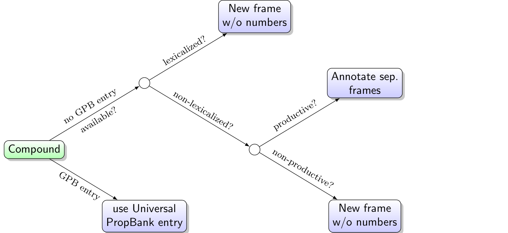
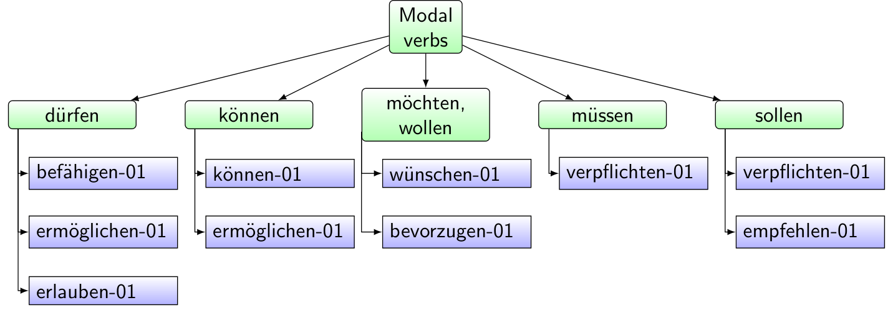

## A Corpus of German Abstract Meaning Representation (DeAMR)

## Abstract

We present the first comprehensive set of guidelines for German Abstract Meaning Representation (Deutsche AMR, DeAMR) along with an annotated corpus of 400 DeAMRs. Taking English AMR (EnAMR) as our starting point, we propose significant adaptations to faithfully represent the structure and semantics of German, focusing particularly on verb frames, compound words, and modality. We validate our annotation through inter-annotator agreement and further evaluate our corpus with a comparison of structural divergences between EnAMR and DeAMR on parallel sentences, replicating previous work that finds both cases of cross-lingual structural alignment and cases of meaningful linguistic divergence. Finally, we fine-tune state-of-the-art multi-lingual and cross-lingual AMR parsers on our corpus and find that, while our small corpus is insufficient to produce quality output, there is a need to continue develop and evaluate against gold non-English AMR data.

## German AMR (DeAMR) Design

We take the guidelines for EnAMR as our starting point to ensure that DeAMR can be integrated with ongoing AMR research and applications. Significant changes are made when EnAMR is inadequate to represent German linguistic phenomena. Among others, this applies in particular to:

**German verb frames**. The Universal PropBank (UP) project is used for German verb frame annotations (Jindal et al., 2022).

**Case marking for agreeing elements.** To ensure consistency in an-
notation, DeAMR uses a labeling convention for
all agreeing elements including nouns, pronouns,
adverbs, and adjectives. These elements are an-
notated in the AMR in nominative case with respect
to the word they agree with in a sentence.

**Formatting.** Node and edge labels are case-
sensitive and include all characters that are used
in German, which can benefit German downstream
parsing. Coordinations and clausal connectives
are migrated from AMR and remain as specified in
the native guidelines.

**Formal pronouns.** Formal pronouns are annotated with an
additional :polite + label.

**Compounds**. Compounds are quite productive in German, such that new words are frequently invented. Here, the sparsity of coverage of German Propbank noted above can be problematic. To tackle this issue, we develop a heuristic to ensure consistent annotation of compounds in DeAMR

    

 

**Modality** The meaning of modal markers, such as modal verbs, are mapped to a matching predicate frame that approximates the modal semantic meaning as illustrated below. Further, To handle MPs in DeAMR, we introduce a set of six new labels that leverage the existing :mode-role to indicate grammatical mood: suprised, conclusive, confirmation-
seeking, irony/sarcasm, confirming and resigning.

    

## DeAMR Corpus & Annotation

The sources for the DeAMR corpus are two different corpora (for which EnAMR annotations also exist): The Little Prince (LLP) (Antoine de Saint-Exupéry, 2015, 2018; LLP) and the AMR 2.0 - Four Translation dataset (FT) (Marco Damonte, Shay Cohen, 2020). The corpus contains 400 sentences and is sampled across subcorpora as follows:

| Genre/Text     | Total Snt. | DeAMR | Avg. Tok. |
|----------------|------------|-------|-----------|
| Proxy (FT)     | 823        | 75    | 18.47     |
| DFA (FT)       | 229        | 86    | 10.31     |
| BOLT (FT)      | 133        | 33    | 8.5       |
| Consensus (FT) | 100        | 77    | 12.86     |
| Xinhua (FT)    | 86         | 29    | 12.31     |
| LLP            | 1562       | 100   | 10.4      |
Total          | 2933       | 400   | 12.92     |

## Evaluation

### Inter-Annotator Agreement & Analysis

IAA was calculated between two expert annotators to assess the effectiveness of the DeAMR guidelines and corpus quality.
A subset of 25 LLP and 15 FT sentences was evaluated, resulting in a Smatch score of 0.7. To better understand our annotation disagreements, we examined 50 annotation differences between Annotator 1 and Annotator 2. We found that of of those 50 differences, only 15 were German-specific, i.e. related to specifically German constructions (in contrast to English) or to the DeAMR guidelines. Among these 15, five differences were due to German PropBank being less complete than the English PropBank: when verb frames were missing, annotators had to choose from a range of workarounds, introducing ambiguities in the annotation process. The remaining 35 annotation differences resulted from general AMR disagreement inherent to EnAMR, too. This indicates that DeAMR annotation may be more difficult than English annotation, but not by much (note that it is also possible that there are English-specific difficulties to AMR annotation, that do not apply to DeAMR, which we cannot measure in this setup).

### Divergences Between EnAMR & DeAMR.

Following the methodology of Wein and Schneider (2021) to classify translation divergences in cross-lingual AMR pairs, we translate the node labels of 100 DeAMRs (50 LPP, 50 FT) into English. We then evaluate the translated AMRs to the parallel gold EnAMRs with Smatch and obtain a score of 0.63, with variance from 0.12 to complete match of 1.0. We find that many divergences in our translations as exhibited by the AMRs do not fit neatly into the outlined categories.

### Parser Evaluation

We use several standard evaluation methods to assess the adequacy of our corpus. First, we evaluate the similarity between DeAMR and EnAMR gold pairs with XS2MATCH (Wein and Schneider, 2022). XS2MATCH is adapted from S2MATCH (Opitz et al., 2020) and evaluates the semantics shared by the AMR pairs. This results in a high XS2Match F-Score of 0.82, indicating that DeAMR and EnAMR exhibit strong semantic similarity, though a gap still exists. The XS2MATCH scores of both models are quite high, which means they grasp the majority of the semantic meaning represented in AMR. However,
the relatively low SMATCH scores within language
(i.e., English) indicate that structural differences in
equivalent AMRs persist. It is also worth noting
that fine-tuning T5 on our corpus does not work:
an F-Score of 0.275 with precision and recall being
0.431 and 0.202 on the test split is unsatisfactory
and points to the need for larger datasets for non-
English languages.

| Evaluation               | Precision | Recall | F-Score |
|--------------------------|-----------|--------|---------|
| **TP(parse_xfm_bart_large)** |           |        |         |
| XS2MATCH(EN-DE)          | 0.808     | 0.769  | 0.788   |
| SMATCH(EN-EN)            | 0.6292    | 0.659  | 0.675   |
| SMATCH(EN-DE)            | 0.420     | 0.434  | 0.427   | 
| **TP(parse_t5)**             |           |        |         |
| XS2SMATCH(EN-DE)         | 0.806     | 0.706  | 0.782   |
| SMATCH(EN-EN)            | 0.686     | 0.648  | 0.667   |
| SMATCH(EN-DE)            | 0.419     | 0.428  | 0.423   |

## Non-English AMR banks are necessary!

The significant adaptations we propose from EnAMR demonstrate EnAMR’s inadequacy in providing complete semantic coverage of German linguistic phenomena. Our qualitative and quantitative evaluations further show evidence that subtle but meaningful structural differences exist across parallel cross-lingual data, and we emphasize the need for continued development of non-English AMR resources to better understand the formalism and its limitations, as well as develop non-English-based parsing methods.

