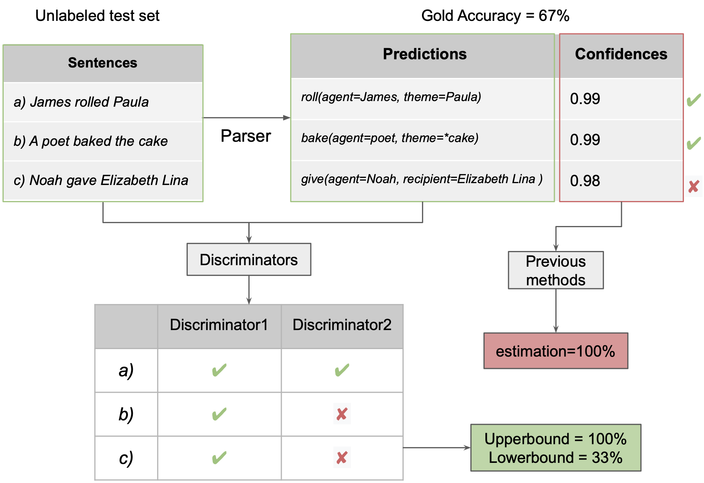
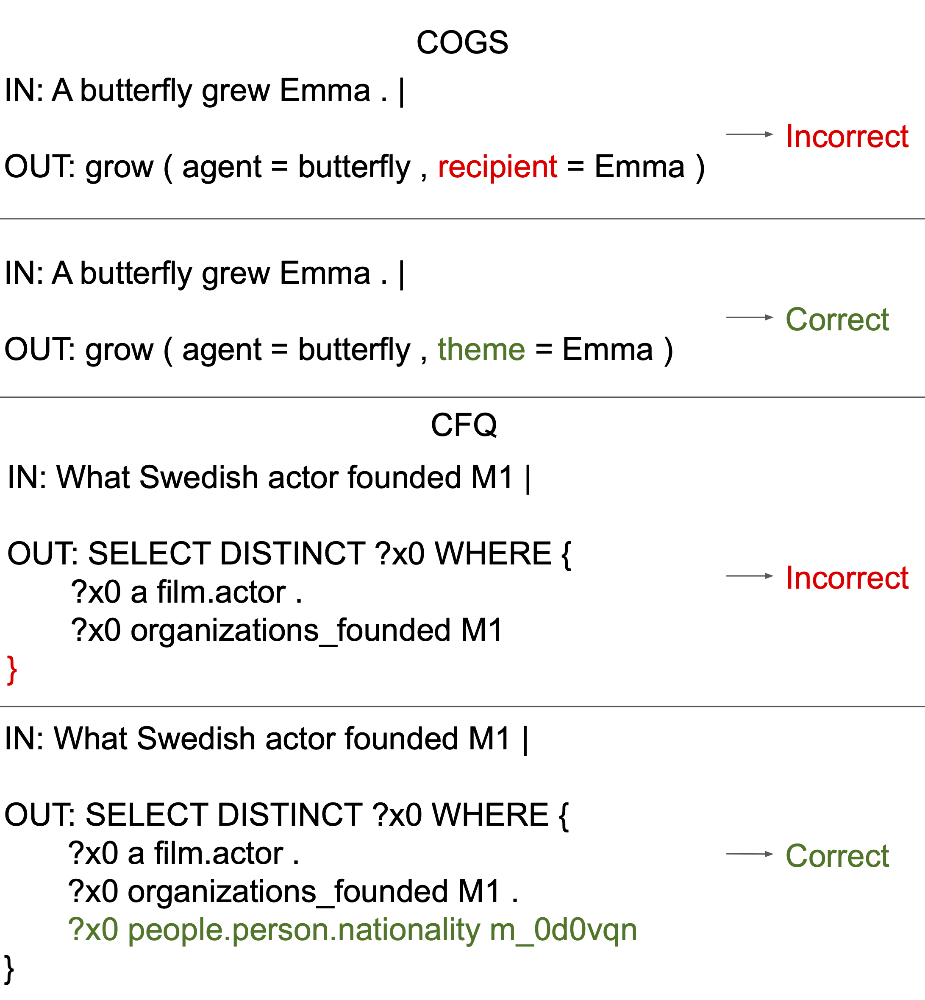
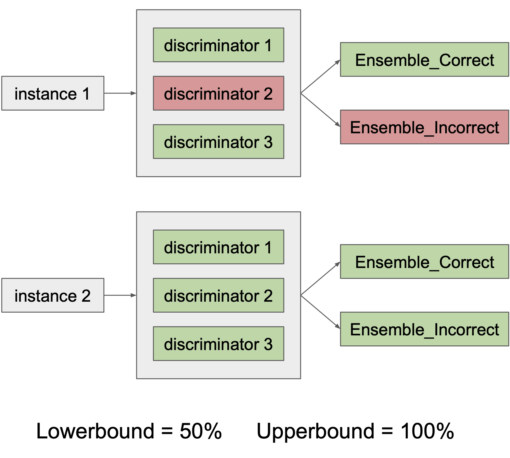
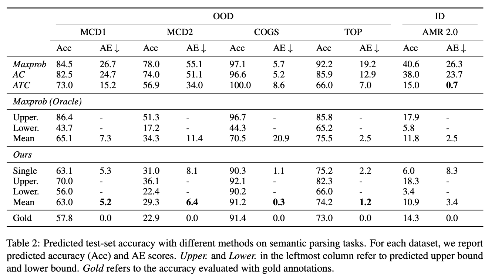

    

## Abstract

The ability to predict an NLP model's accuracy on unseen, potentially out-of-distribution data is a prerequisite for trustworthiness. We present a novel model that establishes upper and lower bounds on the accuracy, without requiring gold labels for the unseen data. We achieve this by training a ***discriminator*** which predicts whether the output of a given sequence-to-sequence model is correct or not. We show across a variety of tagging, parsing, and semantic parsing tasks that the gold accuracy is reliably between the predicted **upper and lower bounds**, and that these bounds are remarkably close together.

In this paper,  we present a method for predicting ***upper and lower bounds***  for the accuracy of a model on unlabeled test data. The example above illustrates how our method works compared to previous confidence-based methods. On an unseen OOD test set, the confidence from a parser is usually an unreliable estimate of its performance. Instead of using such confidence scores, our discriminators discriminates whether an input sentence matches its output sequence (the predicted meaning representation) or not. By using ensemble and a special voting mechanism, our method provides reliable upper and lower bounds that capture the gold accuracy.  

## Methods

The core of our method is a "correctness discriminator model." This model is crucial in determining the accuracy of predictions made by another NLP model (referred to as the "parser") on new, unseen data.

**1. Discriminator Model Design:**

- **Purpose:** The discriminator acts as a binary classifier. Its primary function is to assess if a predicted sequence correctly matches a given natural language sentence.
- **Structure:** We employed a pretrained encoder-decoder language model (e.g., T5, BART). The encoder processes the combination of the input sentence and the predicted sequence, and the decoder then categorizes the combination as either 'Correct' or 'Incorrect'.

**2. Data Collection for Training:**

    

- **Positive Examples:** These are sourced directly from the training set used for the parser.
- **Negative Examples**: Instead of synthesizing errors with designed noise functions (e.g. replacement, deletion), we generate negative examples from the intermediate checkpoints of the parser during its training. Before the parser reaches perfect accuracy on its training set, we capture its incorrect predictions as negative examples.

**3. Predicting Accuracy Bounds:**

    

- We ensemble multiple discriminator predictions with a special voting mechanism to estimate the upper and lower bounds of the predicted accuracy. Figure below provides an example.

## Our bounds reliably capture gold accuracy

    

our predicted upper and lower bounds accurately capture the gold accuracy (i.e. high reliability). This pattern holds for 9 of 10 our datasets, and even for POS-COGS, where this conclusion is not true, the gold accuracy only violates the bounds by a small amount. Meanwhile, the predicted upper and lower bounds are usually close (i.e. high tightness). 

We also compare our method with other point estimation methods by using the mean of bounds as our predicted accuracy (e.g. *Mean* row in *Ours* results).  Although our method is not specifically designed for point estimation, it substantially outperforms previous methods and achieves a relatively low AE score on semantic parsing and POS tagging tasks. On constituency parsing tasks, our method does not outperform \textit{ATC} \cite{garg2022leveraging}, but is still better than other baselines.
Our method is also especially useful for OOD test sets, where confidence-based methods yield a much larger AE. 
