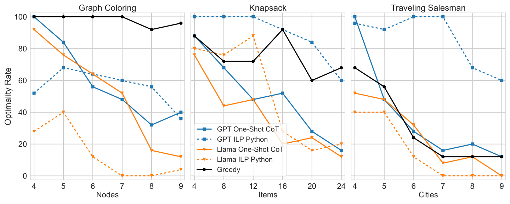

## NOTE: This page is still being developed

## Abstract

We introduce the dataset of Everyday Hard Optimization Problems (EHOP), a collection of NP-hard optimization problems expressed in natural language. EHOP includes problem formulations that could be found in computer science textbooks, versions that are dressed up as problems that could arise in real life, and variants of well-known problems with inverted rules. We find that state-of-the-art LLMs, across multiple prompting strategies, systematically solve textbook problems more accurately than their real-life and inverted counterparts. We argue that this constitutes evidence that LLMs adapt solutions seen during training, rather than leveraging reasoning abilities that would enable them to generalize to novel problems.

## Methods

### Dataset

The EHOP dataset consists of generated instances of three base problems: Graph Coloring, Knapsack, and Traveling Salesman. These instances are presented in standard textbook formulations as well as _costumed_ ones which present the problem in another context. For example, the Graph Coloring problem can be expressed as a teacher wanting to put students (vertices) into groups (colors) without having two students who are friends (connected by an edge) in the same group. The instances are also _inverted_, meaning they are modified to have a similar yet different set of rules. In the case of Graph Coloring, we change the constraint from banning connected nodes with the same color to banning **unconnected** nodes with the same color. The details of inversion are crafted such that an instance is equivalent to its inverted counterpart, in the sense that a solution to one version can be translated in linear time (or faster) to a solution to the other version.

The EHOP dataset comprises two parts: EHOP-RANDOM and EHOP-HARD. EHOP-RANDOM consists of randomly generated instances, and EHOP-HARD consists of randomly generated instances which were not solved optimally by a high-performing greedy algorithm. See our paper for more details on dataset generation and the greedy algorithms used.

### Models & Prompting Strategies

We test GPT-4o and Llama 3.1 70B Instruct on the EHOP dataset using several prompting strategies:

- One-Shot
- Zero-Shot Chain-of-Thought (CoT)
- One-Shot CoT
- ILP Python

In the case of the ILP Python strategy, we prompt the model to translate the problem into an Integer Linear Programming (ILP) specification, written in Python using the [`gurobipy`](https://docs.gurobi.com/projects/optimizer/en/current/reference/python.html) package. We then run the generated code and provide the result back to the model, asking it to use the output to provide a cleanly formatted solution to the original question.

## Results

### Larger Instances are Harder (Except for ILP Python)

The following plot shows performance of GPT and Llama on the EHOP-RANDOM dataset when presented in the textbook formulation:

<center>
    
</center>

Across the board, we see that performance drops as instances get bigger. GPT prompted with ILP Python strategy, however, is more robust to increases in instance size. It also clearly outperforms the other methods in Knapsack and Traveling Salesman. Below are similarly selected results for the EHOP-HARD dataset.

<center>
    
</center>

We again see that GPT ILP Python performs well and is more robust than other methods. We also see that performance drop substantially for the other methods, indicating that EHOP-RANDOM may have rather easy examples of the NP-hard problems, and when these are filtered out, LLMs struggle to truly reason through the problem and generate an optimal solution.

### Textbook is Easier than Other Variants

| Test | Table |
| --- | --- |
| `+test`{:.diff} | x |

```diff
+test
-test
```
