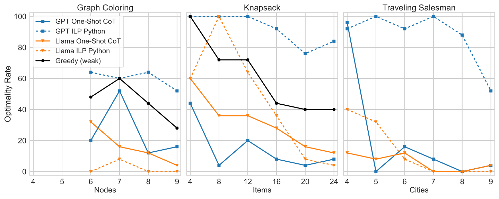

    

# 🚧This page is currently under construction🚧

## Abstract

To investigate the effect of problem presentation on LLMs' ability to solve optimization problems, we introduce the dataset of Everyday Hard Optimization Problems (EHOP), a collection of NP-hard problems expressed in natural language. EHOP includes problem formulations that could be found in computer science textbooks (e.g., graph coloring), versions that are dressed up as problems that could arise in real life (e.g., party planning), and variants with inverted rules. We find that state-of-the-art LLMs, across multiple prompting strategies, systematically solve textbook problems more accurately than their real-life and inverted counterparts. While reasoning models are more capable, they nonetheless show high variance across problem presentations, suggesting they lack a truly robust reasoning mechanism. We argue that this constitutes evidence that LLMs are still heavily dependent on what was seen in training and struggle to generalize to novel problems.

## Background

Many real-world tasks that people face in their personal and professional lives are NP-hard optimization problems. One of the most exciting promises of large language models (LLMs) is that they can help non-experts solve their real-world computational problems when they express them in natural language (NL). The hope is that a wide range of users across a wide range of tasks will be able to describe their problem to the LLM, and the LLM will handle the difficult task of "problem solving," i.e., recognizing that the real-world problem can be described in terms of a known computational problem and then solving that problem efficiently and optimally. In the case of NP-hard problems, this could potentially be accomplished with the LLM solving the problem by itself, e.g., through chain-of-thought (CoT) reasoning, or the LLM could convert the NL description into a linear program (LP) and solve it with specialized tools.

However, recent work has raised the question of "reasoning vs. reciting": are LLMs actually carrying out systematic problem-solving, or are they simply adapting solutions for similar problems in their training data? LLMs that can only solve problems whose solution paths are documented on the Internet will not fulfill the promise of opening general problem-solving to lay users.

We contribute to the reasoning vs. reciting debate by introducing the dataset of Everyday Hard Optimization Problems (EHOP), which consists of NP-hard optimization problems presented in both textbook and real-world variants.

## Methods

### Dataset

    

The EHOP dataset consists of generated instances of three base problems: Graph Coloring, Knapsack, and Traveling Salesman. These instances are presented in standard textbook formulations as well as _costumed_ ones which present the problem in another context. For example, the Graph Coloring problem can be expressed as a teacher wanting to put students (vertices) into groups (colors) without having two students who are friends (connected by an edge) in the same group. The instances are also _inverted_, meaning they are modified to have a similar yet different set of rules. In the case of Graph Coloring, we change the constraint from forbidding connected nodes with the same color to forbidding **unconnected** nodes with the same color. The details of inversion are crafted such that an instance is equivalent to its inverted counterpart, in the sense that a solution to one version can be translated in linear time (or faster) to a solution to the other version.

The EHOP dataset comprises two parts: EHOP-RANDOM and EHOP-HARD. EHOP-RANDOM consists of randomly generated instances, and EHOP-HARD consists of randomly generated instances which were not solved optimally by a high-performing greedy algorithm. See our paper for more details on dataset generation and the greedy algorithms used.

### Models & Prompting Strategies

We test GPT-4o and Llama 3.1 70B Instruct on the EHOP dataset using several prompting strategies:

-   One-Shot
-   Zero-Shot (CoT)
-   One-Shot CoT
-   ILP Python

In the case of the ILP Python strategy, we prompt the model to translate the problem into an Integer Linear Programming (ILP) specification, written in Python using the [`gurobipy`](https://docs.gurobi.com/projects/optimizer/en/current/reference/python.html) package. We then run the generated code and provide the result back to the model, asking it to use the output to provide a cleanly formatted solution to the original question.

## Results

### Larger Instances are Harder (Except for ILP Python)

The following plot shows performance of GPT and Llama on the EHOP-RANDOM dataset when presented in the textbook formulation:

    

Across the board, we see that performance drops as instances get bigger. GPT prompted with ILP Python strategy, however, is more robust to increases in instance size. It also clearly outperforms the other methods in Knapsack and Traveling Salesman. Below are similarly selected results for the EHOP-HARD dataset.

    

We again see that GPT ILP Python performs well and is more robust than other methods. We also see that performance drop substantially for the other methods, indicating that EHOP-RANDOM may have rather easy examples of the NP-hard problems, and when these are filtered out, LLMs struggle to truly reason through the problem and generate an optimal solution.

### Textbook is Easier than Other Variants

In general, we find that LLMs perform substantially better when problems are presented in the textbook variant than when the problems are costumed or inverted.

    

The drop is especially pronounced for the inverted problems, which are worded in ways that make them recognizably related to well-documented archetypes of NP-hard problems. This very likely confuses the LLM, which might not register any difference from the standard problem.

While the ILP Python prompting strategy outperforms the others, it is still sensitive to deviations from the textbook presentations.
This suggests that while the model no longer struggles to perform the right computation, the task of translating a problem to code is nevertheless affected by the ability to recognize the problem (when it is costumed) or to recognize how it deviates from the standard assumptions (when it is inverted).

We show results for EHOP-HARD below. The overall pattern in Table 3 is still that the Textbook variant is easier than the others, except for methods that already perform very poorly on Textbook.

    

## Conclusion

We have shown that current LLMs are much better at solving NP-hard optimization problems when they are
presented in their well-documented textbook form than when they arise as everyday problems or are subtly distorted. This is further evidence that LLMs are often reciting when they appear to be reasoning.

<!-- | Test | Table |
| --- | --- |
| `+test`{:.diff} | `-test`{:.diff} | -->
