

    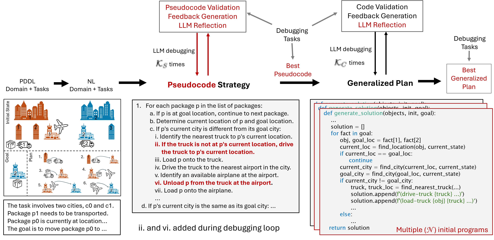

## Improved Generalized Planning with LLMs through Strategy Refinement and Reflection
We introduce **Improved Generalized Planning with LLMs through Strategy Refinement and Reflection**, an approach for **generating Python programs representing generalized plans in PDDL planning**, i.e., plans that generalize across the tasks of a given PDDL domain. Previous work proposed a framework consisting of three steps: the LLM first generates a summary and then a strategy for the domain, both in natural language, and then implements that strategy as a Python program, that gets debugged on example planning tasks. In that work, only one strategy is generated and passed directly to the program generation. If the strategy is incorrect, its implementation will therefore result in an incorrect generalized plan. Here, we introduce an approach that generates the strategy in the form of pseudocode and enables automatic debugging of the pseudocode, hence allowing us to identify and fix errors prior to the generation of the generalized plan itself. Additionally, we extend the Python debugging phase with a reflection step prompting the LLM to pinpoint the reason for the observed plan failure. Finally, we take inspiration from LLM code generation to produce several program variants and pick the best one.

Running experiments on 17 benchmark domains, we show that these extensions substantially improve (and never deteriorate) the quality of the generalized plans. In 12 of the domains, our best Python programs solve all tasks that can be generated with the respective instance generator.

## Example in the Logistics domain

Logistics Domain Description

 
In the Logistics domain we have a specified number of cities which have the same number of locations and each city has one airport. A specified number of airplanes are randomly distributed across all airports. Each task also includes a specified number of trucks, with the only condition that there are at least as many trucks as cities. There can be multiple trucks and airplanes in the same location. A specified number of packages is distributed over all possible locations. The goal specifies for each package a goal location which can be identical to the initial location.

 
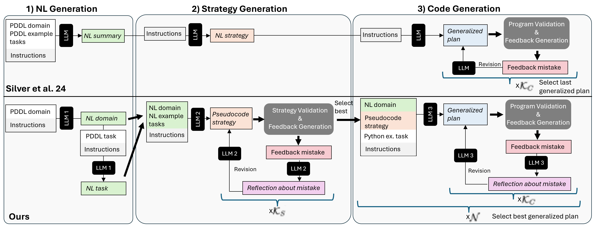

NL Generation

For the strategy validation approach, we provide the domain and debugging task in NL form. Therefore, we require a separate NL description for each debugging task. We obtain the NL descriptions in a two-step process: First, the LLM is prompted to generate the NL domain description given the PDDL domain. Afterwards, the NL description of each debugging task is generated based on its PDDL definition and the PDDL and NL domain descriptions. We also use that NL domain description and two debugging task descriptions as input for the pseudocode generation.

 

Strategy Generation

Our goal is to improve the quality of the strategies that the LLM is asked to implement in order to shift most of the work beyond the mere conversion into Python to the previous step of the generation framework. We therefore instruct the LLM to generate the strategy in the form of pseudocode that should be detailed and specific enough to be converted into an executable program in a straightforward way. The prompt for this step consists of the NL descriptions of the domain and two example tasks and instructions to think step-by-step (zero-shot CoT, Kojima et al., 2022) for developing a strategy that can be turned into a program.
<ul>
  <li>Pseudocode Generation Prompt:
  
  </li>
  <li>Response of the LLM:
    <ul>
      <li>Step-by-step outline of the strategy:
      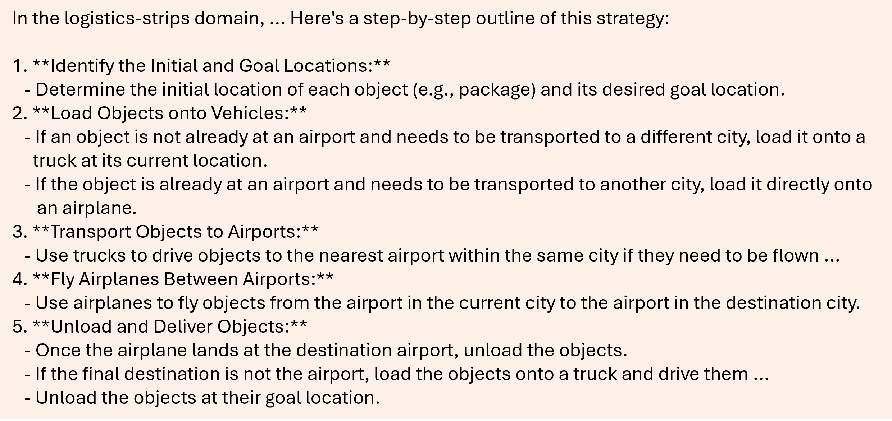
      </li>
      <li>Final strategy in the form of pseudocode:  
      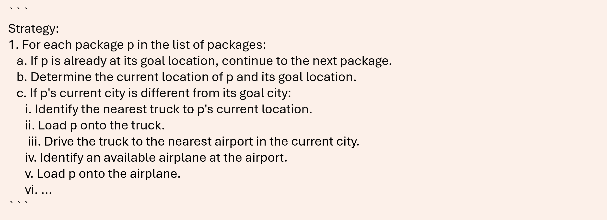
      </li>
    </ul>
  </li>
  <li>Strategy debugging: 
  We provide the pseudocode strategy to an LLM and prompt it to generate the PDDL plan for a given debugging task (in NL) by following the strategy. The generated plan is then validated using VAL. If the plan is incorrect, the validation output is converted into a feedback message.

  Instead of directly prompting the LLM to update the pseudocode based on the feedback, we add a reflection step, inspired by approaches that let LLMs reflect about ways to improve over previous outputs (e.g. Madaan et al. 2023; Shinn et al. 2023). We combine the feedback about the mistake and the generated plan and with instructions to reflect about the part of the pseudocode that caused the mistake and the reason why that part is incorrect. After generating the reflection response based on that prompt, the LLM is then asked to correct the pseudocode by thinking step-by-step. This process is continued until the LLM generates correct plans for all debugging tasks or a maximum number of debugging iterations, K_S, is reached. Then the pseudocode that resulted in the highest number of solved tasks is selected as the pseudocode for the code generation step.
   
  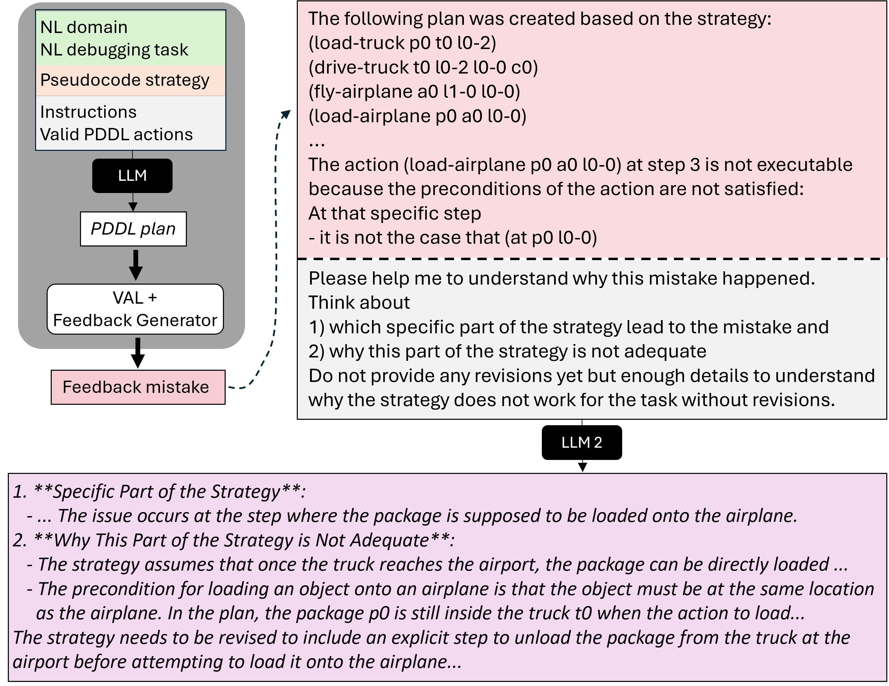
  </li>
</ul>

 

Code Generation

Last but not least, we prompt the LLM to provide python code that implements the generated pseudocode strategy given the NL description of the domain and the pseudocode strategy.
<ul>
  <li>First Code Generation Prompt:
  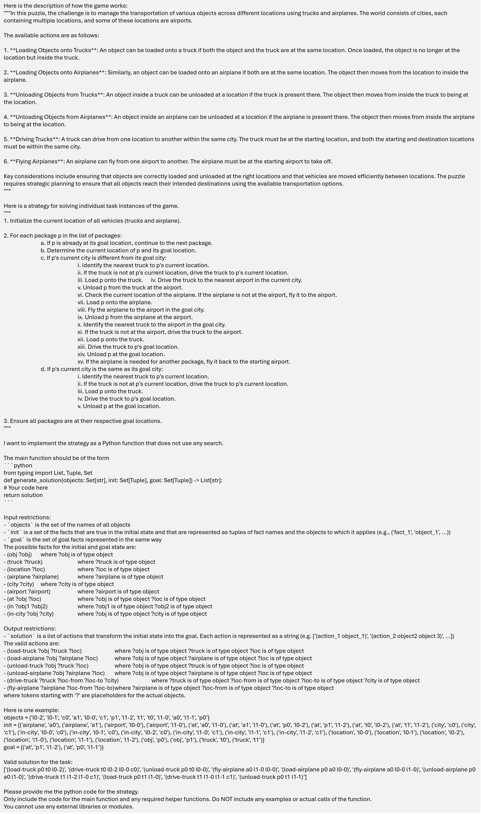
  </li>
  <li>First Code Generation Prompt:
  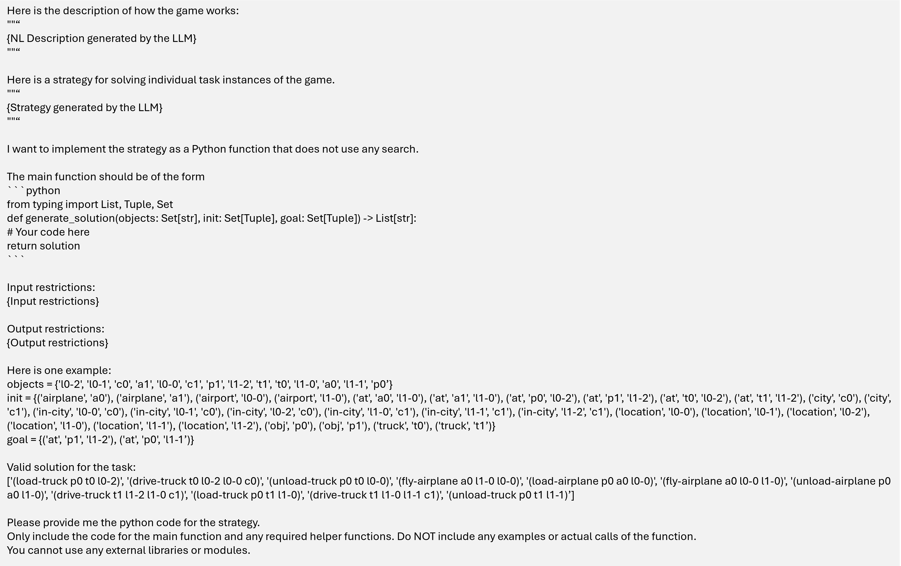
  </li>
  <li>First Code Generation Prompt:
  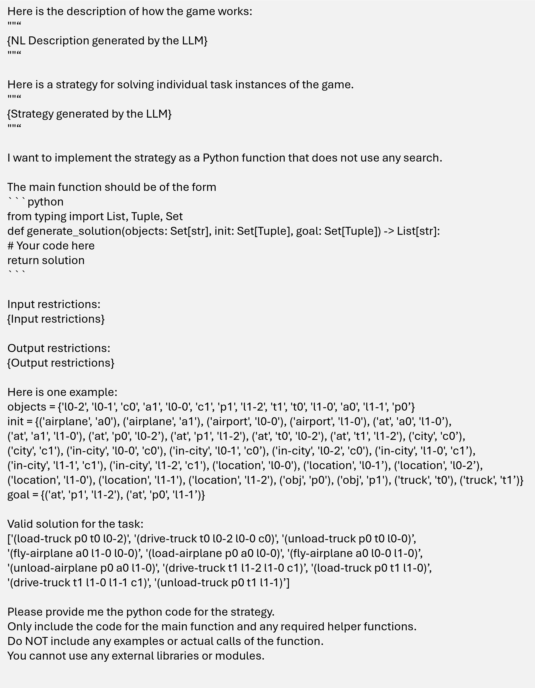
  </li>
  <li>First Code Generation Prompt:
  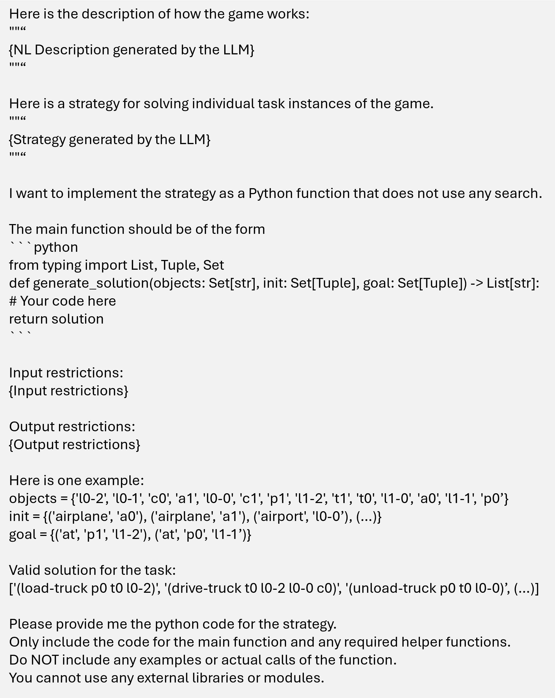
  </li>
  <li>From NL Strategy to Generalized Plan:
  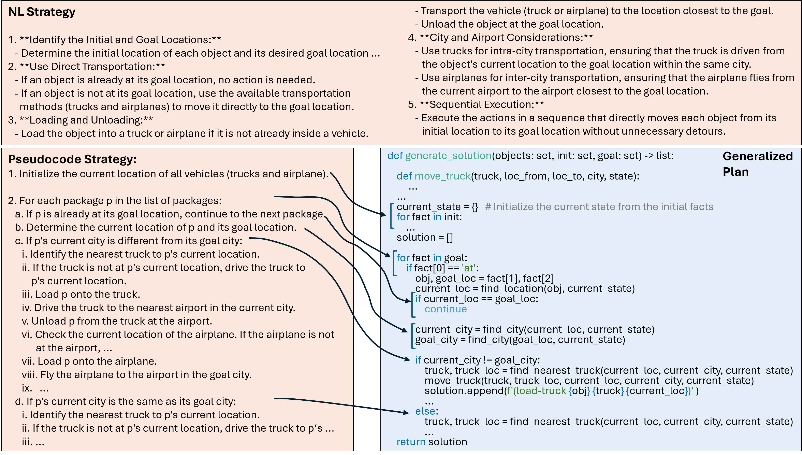
  </li>
  <li>Error Feedback and corresponding Reflection Prompt:  
  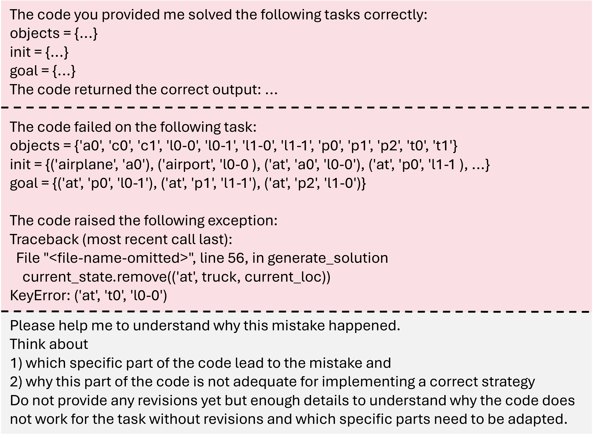
  </li>
</ul>

## Data
For our experiments, we focus on domains that have previously been used in research on LLMs in the context of classical planning. In particular, we use the domains from Silver et al. (2024)’s generalized planning experiments and Stein et al. (2025)’s LLM action-choice experiments. Table 2 shows for each of the domains the sources of the tasks we include in our experiments. All tasks included in our experiments are solvable. The right column of Table 2 shows the origin of the instance generators that we used to generate additional tasks for some of the domains, and that we used for the manual evaluation of the generalization power of our generalized plans.

Table 2

<figure style="width:50%;margin:0; text-align:justify;">
  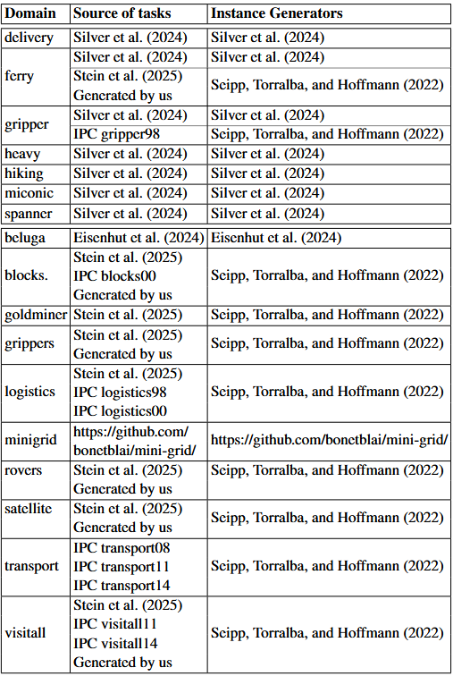
  <figcaption style="font-style: normal;">Table 2: The origin of all tasks that we used for our experiments and the instance generators that we used for the manual evaluation and for generating additional data for some of the domains.</figcaption>
</figure>

## Experiments and Results 

**Metrics** 
* Coverage: The percentage of evaluation tasks for which the Python program generates a correct plan.
    * Average: The average coverage over all runs.
    * Best: The coverage of the best run.  
 
For running the Python programs on the evaluation tasks, we impose the same time limit of 45s as in debugging. As the Python program output sometimes depends on the ordering of objects and initial/goal facts in the input, we run 4 random orderings and treat the output as correct only if all runs succeed.

**Our Framework** 
We test our generalized planning framework for two different combinations of the maximum number of initial programs (N ) and code debugging steps (KC ). For one experiment we set N = 3 and KC = 6, resulting in a maximum of 21 generated programs. For the other experiment, we set N = 5 and KC = 3, hence increasing the number of initial programs while keeping the maximum number of generated programs similar (20). We refer to the two versions as F3-6 and F5-3. For both versions we set KS = 6.

**Ablations** 
We conduct three ablation experiments to assess the effect of our pipeline extensions. The base approach for all ablation experiments is F3-6. We assess the effect of generating multiple initial programs by setting N = 1 (-MC). In order to test to what extent debugging at the strategy level is beneficial we set KS to 0 (-SD). Lastly, we prompt the LLM to revise the code directlyRac based on the feedback, to assess the effect of the reflection step (-CR).

**Baselines** 
We compare the performance of our approach to the framework by Silver et al. (2024) with GPT-4o (Sil) and to a re-implementation of their pipeline (Bas). For the re-implementation we make a number of smaller changes to the original pipeline for a fairer comparison. First, we adapt the phrasing of the prompts to be more similar to our prompts, including instructions to think step-by-step for generating the NL strategy. We also separate the three parts of the pipeline and use the output of the previous step as part of the input for the next step, as done in our main frame- work. To account for the fact that no PDDL is available at code generation time, we provide the definition of the example task and of the failed task in Python format. Lastly, the final program is selected based on the debugging data.

**Symbolic Baselines** 

* lm: optimal A* and the LM-Cut heuristic (Helmert et al. 2009), ran with a 30-minute time limit.
* ff: satisficing greedy best-first search with FF heuristic (Hoffmann and Nebel, 2001), ran with a 30-minute time limit.
* ff= and lm=: Like lm and ff but with the same 45s time limit as applied to the execution of generalized plans.

### Results:

<figure style="width:100%;margin:0; text-align:justify;">
  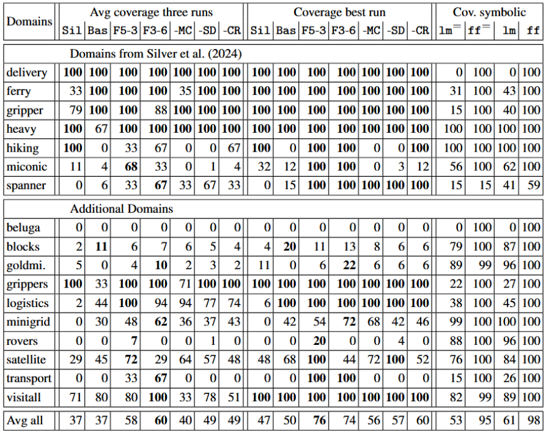
  <figcaption style="font-style: normal;">Table 1: Percentage of solved tasks for the original framework by Silver et al. (2024) (Sil) and the re-implemented baseline (Bas) and our generalized planning approach with N = 3, KC = 6 (F3-6) and N = 5, KC = 3 (F5-3). The three ablations -MC, -SD and -CR are based on F3-6. We report the average coverage over three runs and coverage of the best run. For both, we show in bold the best generalized planning approach. The symbolic baselines were run for the same time limit as the generalized plans (45 seconds) (lm= and ff=) and for 30 minutes (lm and ff).</figcaption>
</figure>
 
<figure style="width:100%;margin:0; text-align:justify;">
  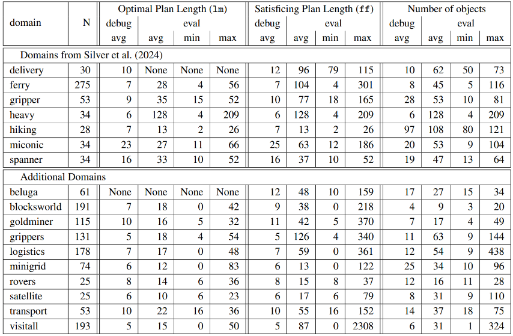
  <figcaption style="font-style: normal;">Table 3: The number of tasks for each domain (N), and the average (avg), minimum (min) and maximum (max) values of the plans derived by the lm and ff symbolic planners and number of objects for the evaluation tasks (eval) as well as the average values of the debugging tasks (debug). Tasks for which the symbolic planner did not find a plan were left out in the computation of the average plan length values.</figcaption>
</figure>
 

  <figure style="width:45%; margin:0 auto; text-align:justify;">
    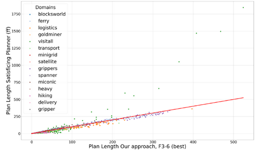
    <figcaption style="font-style:normal;">Figure 8: Length of the plan generated by F3-6 (best) (x-axis) and by ff (y-axis) for each commonly solved task. Diagonal is plotted in red.</figcaption>
  </figure>
  <figure style="width:45%; margin:0 auto; text-align:justify;">
    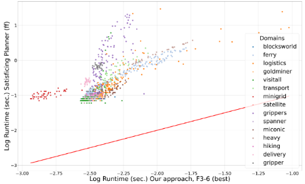
    <figcaption style="font-style:normal;">Figure 9: Runtime of the best generalized plan by F3-6 (x-axis) and of ff (y-axis) for each commonly solved task. Diagonal is plotted in red.</figcaption>
  </figure>

## References

More Detail

M. Helmert and C. Domshlak. Landmarks, critical paths and abstractions: What’s the difference anyway? In *Proceedings of the 19th International Conference on Automated Planning and Scheduling, ICAPS*. AAAI, 2009. 
J. Hoffmann and B. Nebel. The FF planning system: Fast plan generation through heuristic search. 'Journal of Artificial Intelligence Research*, 14:253–302, 2001. 
K. Valmeekam, M. Marquez, A. Olmo, S. Sreedharan, and S. Kambhampati. Planbench: An extensible benchmark for evaluating large language models on planning and reasoning about change. In *Thirty-seventh Conference on Neural Information Processing Systems Datasets and Benchmarks Track*, 2023. 
K. Valmeekam, M. Marquez, S. Sreedharan, and S. Kambhampati. On the planning abilities of large language models - a critical investigation. In *Advances in Neural Information Processing Systems*, pages 75993– 76005. Curran Associates, Inc., 2023. 
J. Wei, X. Wang, D. Schuurmans, M. Bosma, b. ichter, F. Xia, E. Chi, Q. V. Le, and D. Zhou. Chain-of-thought prompting elicits reasoning in large language models. In *Advances in Neural Information Processing Systems*, volume 35, pages 24824–24837. Curran Associates, Inc., 2022. 
S. Yao, J. Zhao, D. Yu, N. Du, I. Shafran, K. R. Narasimhan, and Y. Cao. React: Synergizing reasoning and acting in language models. In *The Eleventh International Conference on Learning Representations*, 2023. 
Bonet, B.; Palacios, H.; and Geffner, H. 2009. Automatic Derivation of Memoryless Policies and Finite-State Controllers Using Classical Planners. Proceedings of the International Conference on Automated Planning and Scheduling, 19(1): 34–41. 
Du, X.; Liu, M.; Wang, K.; Wang, H.; Liu, J.; Chen, Y.;Feng, J.; Sha, C.; Peng, X.; and Lou, Y. 2024. Evaluating Large Language Models in Class-Level Code Generation. In Proceedings of the IEEE/ACM 46th International Conference on Software Engineering, ICSE’24. New York, NY, USA: Association for Computing Machinery. ISBN 9798400702174.<nr>
Eisenhut, J.; Schuler, X.; Fiˇser, D.; H¨oller, D.; Christakis, M.; and Hoffmann, J. 2024. New Fuzzing Biases for Action Policy Testing. Proceedings of the International Conference on Automated Planning and Scheduling, 34(1): 162–167. 
Haslum, P.; Lipovetzky, N.; Magazzeni, D.; and Muise, C. 2019. An Introduction to the Planning Domain Definition Language. Synthesis Lectures on Artificial Intelligence and Machine Learning. Morgan & Claypool Publishers. ISBN 978-3-031-00456-8. 
Helmert, M.; and Domshlak, C. 2009. Landmarks, Critical Paths and Abstractions: What’s the Difference Anyway? In Proceedings of the 19th International Conference on Automated Planning and Scheduling, ICAPS. AAAI. 
Hoffmann, J.; and Nebel, B. 2001. The FF Planning System: Fast Plan Generation Through Heuristic Search. Journal of Artificial Intelligence Research, 14: 253–302. 
Holtzman, A.; Buys, J.; Du, L.; Forbes, M.; and Choi, Y. 2020. The Curious Case of Neural Text Degeneration. arXiv:1904.09751. 
Howey, R.; Long, D.; and Fox, M. 2004. VAL: Automatic Plan Validation, Continuous Effects and Mixed Initiative Planning Using PDDL. In 16th IEEE International Conference on Tools with Artificial Intelligence (ICTAI 2004), 15-17 November 2004, Boca Raton, FL,USA, 294–301. IEEE Computer Society. 
Jim´enez, S.; Segovia-Aguas, J.; and Jonsson, A. 2019. A review of generalized planning. The Knowledge Engineering Review, 34: e5. 
Kambhampati, S.; Valmeekam, K.; Guan, L.; Verma, M.; Stechly, K.; Bhambri, S.; Saldyt, L. P.; and Murthy, A. B. 2024. Position: LLMs Can’t Plan, But Can Help Planning in LLM-Modulo Frameworks. In Forty-first International Conference on Machine Learning. 
Kojima, T.; Gu, S. S.; Reid, M.; Matsuo, Y.; and Iwasawa, Y. 2022. Large Language Models are Zero-Shot Reasoners. In Koyejo, S.; Mohamed, S.; Agarwal, A.; Belgrave,D.; Cho, K.; and Oh, A., eds., Advances in Neural Information Processing Systems, volume 35, 22199–22213. Curran Associates, Inc. 
Madaan, A.; Tandon, N.; Gupta, P.; Hallinan, S.; Gao, L.; Wiegreffe, S.; Alon, U.; Dziri, N.; Prabhumoye, S.; Yang, Y.; Gupta, S.; Majumder, B. P.; Hermann, K.; Welleck, S.; Yazdanbakhsh, A.; and Clark, P. 2023. Self-Refine: Iterative Refinement with Self-Feedback. In Oh, A.; Naumann, T.; Globerson, A.; Saenko, K.; Hardt, M.; and Levine, S., eds., Advances in Neural Information Processing Systems, volume 36, 46534–46594. Curran Associates, Inc. McDermott, D. M. 2000. The 1998 AI planning systems competition. AI magazine, 21(2): 35–35. 
Seipp, J.; Torralba, ´A.; and Hoffmann, J. 2022. PDDL Generators. https://doi.org/10.5281/zenodo.6382173. 
Shinn, N.; Cassano, F.; Gopinath, A.; Narasimhan, K.; and Yao, S. 2023. Reflexion: language agents with verbal reinforcement learning. In Oh, A.; Naumann, T.; Globerson, A.; Saenko, K.; Hardt, M.; and Levine, S., eds., Advances in Neural Information Processing Systems, volume 36, 8634–8652. Curran Associates, Inc. 
Silver, T.; Dan, S.; Srinivas, K.; Tenenbaum, J. B.; Kaelbling, L.; and Katz, M. 2024. Generalized Planning in PDDL Domains with Pretrained Large Language Models. Proceedings of the AAAI Conference on Artificial Intelligence, 38(18): 20256–20264. 
Srivastava, S.; Immerman, N.; and Zilberstein, S. 2011. A new representation and associated algorithms for generalized planning. Artif. Intell., 175(2): 615–647. 
Stechly, K.; Valmeekam, K.; and Kambhampati, S. 2025. On the self-verification limitations of large language models on reasoning and planning tasks. In The Thirteenth International Conference on Learning Representations. 
Stein, K.; Fiˇser, D.; Hoffmann, J.; and Koller, A. 2025. Automating the Generation of Prompts for LLM-based Action Choice in PDDL Planning. In Proceedings of the 35th International Conference on Automated Planning and Scheduling (ICAPS’25). 
Tang, H.; Hu, K.; Zhou, J. P.; Zhong, S.; Zheng, W.-L.; Si, X.; and Ellis, K. 2024. Code Repair with LLMs gives an Exploration-Exploitation Tradeoff. In Globerson, A.; Mackey, L.; Belgrave, D.; Fan, A.; Paquet, U.; Tomczak, J.; and Zhang, C., eds., Advances in Neural Information Processing Systems, volume 37, 117954–117996. Curran Associates, Inc. 
Valmeekam, K.; Marquez, M.; Sreedharan, S.; and Kambhampati, S. 2023. On the Planning Abilities of Large Language Models - A Critical Investigation. In Oh, A.; Naumann, T.; Globerson, A.; Saenko, K.; Hardt, M.; and Levine, S., eds., Advances in Neural Information Processing Systems, volume 36, 75993–76005. Curran Associates, Inc. Wang, E.; Cassano, F.; Wu, C.; Bai, Y.; Song, W.; Nath, V.; Han, Z.; Hendryx, S.; Yue, S.; and Zhang, H. 2024. Planning In Natural Language Improves LLM Search For Code Generation. arXiv:2409.03733. 
Wei, J.; Wang, X.; Schuurmans, D.; Bosma, M.; ichter, b.; Xia, F.; Chi, E.; Le, Q. V.; and Zhou, D. 2022. Chain-of-Thought Prompting Elicits Reasoning in Large Language Models. In Koyejo, S.; Mohamed, S.; Agarwal, A.; Belgrave, D.; Cho, K.; and Oh, A., eds., Advances in Neural Information Processing Systems, volume 35, 24824–24837. Curran Associates, Inc. 

