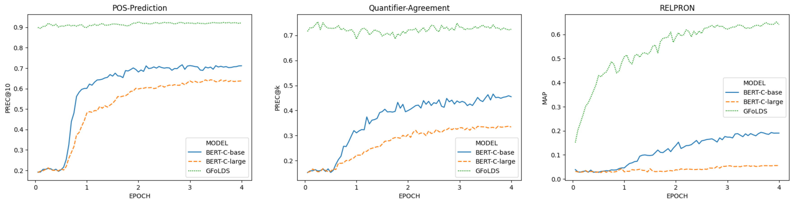
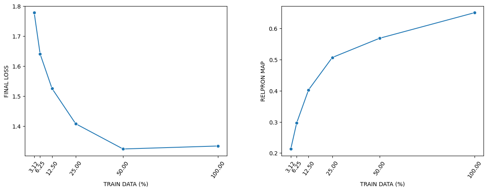

    

# Abstract

We make the case for language models over logical forms (LFLMs), arguing that such models are more data-efficient than their textual counterparts. To that end, we introduce the <ins>G</ins>raph-based <ins>Fo</ins>rmal-<ins>L</ins>ogical <ins>D</ins>istributional <ins>S</ins>emantics (GFoLDS) prototype, a pretrained LM over graph representations of logical forms, as a proof-of-concept of LFLMs. Using GFoLDS, we present strong experimental evidence that LFLMs can leverage the built-in, basic linguistic knowledge inherent in such models to immediately begin learning more complex patterns. On downstream tasks, we show that GFoLDS vastly outperforms textual, transformer LMs pretrained on similar amounts of data, indicating that LFLMs can learn with substantially less data than models over plain text. Furthermore, we show that the performance of this model is likely to scale with additional parameters and pretraining data, suggesting the viability of LFLMs in real-world applications.

# Why Logical Forms?

Given the Chinchilla Scaling Laws (Hoffmann et al., 2022) and the rate at which SoTA LLMs are expanding, (Villalobos et al., 2024) estimate that high-quality English training data will be exhausted at some point between 2026 and 2032: language model expansion is outpacing available natural language production. This suggests that&mdash;without models that use significantly less data than current approaches&mdash;LLMs' performance increases will begin to decelerate substantially in the near future.

To address this, we argue that there are two main advantages of LFLMs versus models over plain text, that allow them to learn from less data:

1. The function-argument structure of logical forms has a syntactic equivalence-classing/de-noising effect: all syntactic paraphrases of the same proposition&mdash;for example, an active sentence and its passive counterpart&mdash;are mapped to the same representation. This means that an LFLM does not need to learn to equate periphrastic structures, so it can immediately begin learning co-occurrence relations between predicates.

2. DMRS (Copestake, 2009)&mdash;the logical-form representation framework that we use in this work&mdash;includes morphosyntactic features (number, tense, person, etc.). This further de-noises the model’s input by offloading the morphological realization of these properties to explicitly annotated labels: an LFLM does not need to learn the surface patterns corresponding to inflection, because this information is explicitly provided. For example, an LM over logical forms does not need to learn that the suffix *–s* denotes a plural noun&mdash;or irregular realizations of pluralization, e.g. *goose/geese*&mdash;because plural nouns are directly labeled as such.

These observations lead us to the following hypothesis:

<pre>
<b>The Linguistic Knowledge Catalysis Hypothesis (LKCH):</b>
The (aspects of) linguistic knowledge incorporated into LFLMs greatly accelerates their learning of elementary linguistic phenomena, in turn accelerating the learning of more complex patterns.
</pre>

The key corollary of the LKCH is that LFLMs can learn with less data: the linguistic knowledge built into LFLMs facilitates more rapid learning of advanced phenomena.

# Key Contributions

1. **Provide experimental support towards the validity of the LKCH:** we demonstrate that&mdash;from the start of pretraining&mdash;GFoLDS achieves near-peak performance on tasks designed to evaluate its elementary linguistic knowledge, and that this translates to more rapid learning of complex phenomena.
2. **Demonstrate the viability of pretrained LFLMs:** we show that GFoLDS outperforms BERT models pretrained on the same data on all evaluation benchmarks.
3. **Establish the scalability of GFoLDS:** we present evidence that GFoLDS is likely to scale with respect to parameter count and pretraining dataset size, indicating that LFLMs have the potential to compete with textual LLMs at scale.

# GFoLDS

    

 

GFoLDS is a graph transformer architecture (Wu et al., 2021): a graph neural network (GNN) that encodes local neighborhood information, whose output is then fed to a permutation-invariant (i.e. without linear positional embeddings) transformer encoder for global message-passing (attention). Unique to this work is the GNN component of the model, which is specially adapted to the directed, edge-/node-labeled structure of GFoLDS' DMRS input graphs. 

We pretrained GFoLDS for four epochs on ~17.5 million sentences drawn from English Wikipedia: ~6.5x smaller than BERT's pretraining corpus. The model's pretraining objective was masked-node modeling (MNM), which is analogous to the MLM objective used to pretrain encoder transformer LMs.

At 174 million parameters, the size of GFoLDS is roughly halfway between that of BERTbase (110 million) and BERTlarge (335 million).

# Experiments

### LKCH

We first evaluated the validity of the LKCH. Note that this hypothesis can be broken down into two distinct claims:

1. The (aspects of) linguistic knowledge incorporated into LFLMs greatly accelerates their learning of elementary linguistic phenomena.
2. This accelerates the learning of more complex patterns.

To compare GFoLDS' learining-acceleration to a similarly-sized textual model, we pretrained two BERT comparison (BERT-C) models on the same data (the surface sentences, not the logical forms) for the same number of epochs (four).

To test (1), we evaluated the model on two tasks designed to probe its elementary linguistic knowledge: POS prediction and quantifier prediction. For (2), we evaluated the model on the RELPRON dataset (Rimell et al., 2016). Due to the claim made in the LKCH that linguistically-informed LMs' learning of complex patterns is *accelerated*, we evaluated the model at regular intervals throughout pretraining (80 evenly-spaced chackpoints), in order to measure the rate at which GFoLDS is learning. 

Assuming that the LKCH holds, we should expect to see GFoLDS outperform the BERT-C models on the complex task (RELPRON) throughout the pretraining process, as&mdash;according to the hypothesis&mdash;GFoLDS is able to learn complex patterns faster than textual LMs. 

On the elementary tasks, we again expect GFoLDS to outperform BERT-C, but also that GFoLDS' performance will improve substantially faster than it does on the complex tasks: the LKCH predicts that an LFLM's accelerated learning of elementary phenomena catalyzes its learning of complex patterns, so its learning of the former should therefore accelerate at a faster rate than that of the latter.

 

    

 

The results of this experiment conform almost exactly to the behavior predicted by the LKCH: on the elementary tasks, GFoLDS starts near peak performance from the first checkpoint&mdash;this indicates that its learning of elementary patterns was complete within 5% of the first epoch. On the complex task, GFoLDS begins improving immediately, BERT-Clarge does not improve substantially, and the performance of BERT-Cbase doesn't begin to meaningfully increase until the latter half of the first epoch (and at a lower rate than that of GFoLDS): the point at which it began to improve on the elementary tasks.

These results show that GFoLDS can model the elementary phenomena almost from the onset (and retains this ability throughout pretraining) and GFoLDS' performance on the RELPRON test set suggests that this vastly accelerated learning of elementary phenomena translates to more rapid learning of more complex patterns, as predicted by the LKCH.

### Downstream Tasks

To demonstrate the viability of LFLMs, we compared GFoLDS to BERT-C and the original BERT models on four downstream benchmarks: RELPRON, SNLI (Bowman et al., 2015), the MegaVeridicality V2.1 binary factuality-classification task (White et al., 2018), and the
McRae et al. (2005) property inference dataset.

 

| | RELPRON (MAP) | SNLI (Acc) | MegaVeridicality V2.1 (Acc) | McRae et al. (Spearman ρ)|
| :--- | :--- | :--- | :--- | :--- |
| **GFoLDS:** | 0.651 | 81.0% | 81.3% | 0.205 |
| **BERT-Cbase:** | 0.193 | 79.9% | 78.1% | 0.167 |
| **BERT-Clarge:** | 0.056 | 62.0% | 76.2% | 0.134 |
| **BERTbase:** | 0.690 | 90.7% | 84.2% | 0.247 |
| **BERTlarge:** | 0.769 | 91.1% | 85.6% | 0.241 |

 

Although the original BERT models outperform GFoLDS, they were both trained on 6.5x more data for 10x more epochs than our model. On the other hand, the BERT comparison models trained on the same data as our model (BERT-C) both lag behind GFoLDS on all four benchmarks&mdash;particularly on RELPRON&mdash;demonstrating across a wide range of downstream tasks that our model is able to learn useful representations with less data than its textual counterparts.

### Scalability

While GFoLDS outperforms textual models trained on similar amounts of data, this model is still outperformed by the original BERT models. It is therefore crucial to establish the scalability of GFoLDS: the degree to which we would expect its downstream performance to scale if it were larger and/or pretrained on more data. To that end, we applied the techniques of Muennighoff et al. (2024) to GFoLDS, to determine the degree to which our model is under- or over-parameterized&mdash;and therefore, by the scaling laws established in Muennighoff et al. (2024), over- or under-trained.

Specifically, we pretrained five GFoLDS models on 50%, 25%, 12.5%, 6.25%, and 3.125% of the pretraining data used in the model introduced above. We then evaluated the impact of pretraining token count on final pretraining loss and performance on a validation task: the RELPRON dataset, which does not require fine-tuning (fine-tuning could introduce confounding factors).

 

    

 

Final pretraining loss (left) consistently decreases as the number of pretraining tokens increases from 3.125% to 50% of the data. After this point, the final loss value plateaus: we prove that&mdash;assuming that an analogue of the Muennighoff et al. (2024) scaling laws holds for the GFoLDS architecture&mdash;it can only be the case that the final loss for the 100% run is (roughly) equal to that for the 50% run if GFoLDS is underparameterized for both the 100% run *and* the 50% run. This means that GFoLDS requires much less pretraining data per parameter than textual models: the Chinchilla Scaling Laws (Hoffmann et al., 2022) predict that a textual LLM with the same parameter count (174 million) as GFoLDS necessitates ~5 billion pretraining tokens. This is roughly twenty times more than the 254 million tokens for which GFoLDS is overparameterized.

On the RELPRON validation task (right), we observe improvement of +0.082 in MAP score from the 50% (0.569) to the 100% (0.651) run, which is *higher* than the +0.062 increase from the 25% (0.507) to the 50% run.

Taken together, these results lead to the conclusion that GFoLDS is likely scalable in terms of model size and pretraining data.

# References

Samuel R Bowman, Gabor Angeli, Christopher Potts, and Christopher D Manning. 2015. A Large Annotated Corpus for Learning Natural Language  Inference. *arXiv preprint arXiv:1508.05326*.

Ann Copestake. 2009. Invited Talk: Slacker Semantics: Why Superficiality, Dependency and Avoidance of Commitment can be the Right Way to Go. In *Proceedings of the 12th Conference of the European Chapter of the ACL (EACL 2009)*, 1–9.

Jordan Hoffmann, Sebastian Borgeaud, Arthur Mensch, Elena Buchatskaya, Trevor Cai, Eliza Rutherford, Diego de Las Casas, Lisa Anne Hendricks, Johannes Welbl, Aidan Clark, Tom Hennigan, Eric Noland, Katie Millican, George van den Driessche, Bogdan Damoc, Aurelia Guy, Simon Osindero, Karen Simonyan, Erich Elsen, Jack W Rae, Oriol Vinyals, and Laurent Sifre. 2022. Training Compute-Optimal Large Language Models. *arXiv preprint arXiv:2203.15556*.

Ken McRae, George S Cree, Mark S Seidenberg, and Chris McNorgan. 2005. Semantic Feature Production Norms for a Large Set of Living and Nonliving Things. *Behavior Research Methods*, 37(4):547–559.

Niklas Muennighoff, Alexander Rush, Boaz Barak, Teven Le Scao, Nouamane Tazi, Aleksandra Piktus, Sampo Pyysalo, Thomas Wolf, and Colin A Raffel. 2024. Scaling Data-Constrained Language Models. *Advances in Neural Information Processing Systems*, 36.

Laura Rimell, Jean Maillard, Tamara Polajnar, and Stephen Clark. 2016. RELPRON: A Relative Clause Evaluation Data Set for Compositional Distributional Semantics. Computational Linguistics, 42(4):661–701.

Pablo Villalobos, Anson Ho, Jaime Sevilla, Tamay Besiroglu, Lennart Heim, and Marius Hobbhahn. 2024. Position: Will We Run out of Data? Limits of LLM Scaling Based on Human-Generated Gata. In *Forty-first International Conference on Machine Learning*.

Aaron Steven White, Rachel Rudinger, Kyle Rawlins, and Benjamin Van Durme. 2018. Lexicosyntactic Inference in Neural Models. In *Proceedings of the 2018 Conference on Empirical Methods in Natural Language Processing*, 4717–4724.

Zhanghao Wu, Paras Jain, Matthew Wright, Azalia Mirhoseini, Joseph E Gonzalez, and Ion Stoica. 2021. Representing Long-Range Context for Graph Neural Networks with Global Attention. *Advances in Neural Information Processing Systems*, 34:13266–13279.
