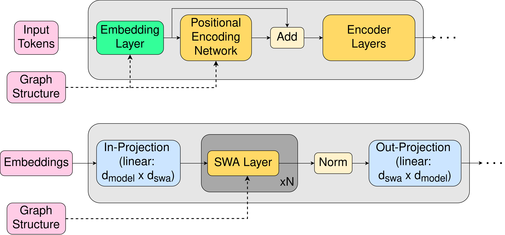

    

# Abstract

We make the case for language models over logical forms (LFLMs), arguing that such models are more data-efficient than their textual counterparts. To that end, we introduce the <ins>G</ins>raph-based <ins>Fo</ins>rmal-<ins>L</ins>ogical <ins>D</ins>istributional <ins>S</ins>emantics (GFoLDS) prototype, a pretrained LM over graph representations of logical forms, as a proof-of-concept of LFLMs. Using GFoLDS, we present strong experimental evidence that LFLMs can leverage the built-in, basic linguistic knowledge inherent in such models to immediately begin learning more complex patterns. On downstream tasks, we show that GFoLDS vastly outperforms textual, transformer LMs pretrained on similar amounts of data, indicating that LFLMs can learn with substantially less data than models over plain text. Furthermore, we show that the performance of this model is likely to scale with additional parameters and pretraining data, suggesting the viability of LFLMs in real-world applications.

# Why Logical Forms?

We argue that there are two main advantages of LFLMs versus models over plain text, that allow them to learn from less data:

1. The function-argument structure of logical forms has a syntactic equivalence-classing/de-noising effect: all syntactic paraphrases of the same proposition&mdash;for example, an active sentence and its passive counterpart&mdash;are mapped to the same representation. This means that an LFLM does not need to learn to equate periphrastic structures, so it can immediately begin learning co-occurrence relations between predicates.

2. DMRS (Copestake, 2009)&mdash;the logical-form representation framework that we use in this work&mdash;includes morphosyntactic features (number, tense, person, etc.). This further de-noises the model’s input by offloading the morphological realization of these properties to explicitly annotated labels: an LFLM does not need to learn the surface patterns corresponding to inflection, because this information is explicitly provided. For example, an LM over logical forms does not need to learn that the suffix *–s* denotes a plural noun&mdash;or irregular realizations of pluralization, e.g. *goose*/*geese*&mdash;because plural nouns are directly labeled as such.

These observations lead us to the following hypothesis:

<pre>
<b>The Linguistic Knowledge Catalysis Hypothesis (LKCH):</b>
The (aspects of) linguistic knowledge incorporated into LFLMs greatly accelerates their learning of elementary linguistic phenomena, in turn accelerating the learning of more complex patterns
</pre>

The key corollary of the LKCH is that LFLMs can learn with less data: the linguistic knowledge built into LFLMs facilitates more rapid learning of advanced phenomena.

# Key Contributions

1. Provide experimental support towards the validity of the LKCH: we demonstrate that&mdash;from the start of pretraining&mdash;GFoLDS achieves near-peak performance on tasks designed to evaluate its elementary linguistic knowledge, and that this translates to more rapid learning of complex phenomena.
2. Demonstrate the viability of pretrained LFLMs: we show that GFoLDS outperforms BERT models pretrained on the same data on all evaluation benchmarks.
3. Establish the scalability of GFoLDS: we present evidence that GFoLDS is likely to scale with respect to parameter count and pretraining dataset size, indicating that LFLMs have the potential to compete with textual LLMs at scale.

# GFoLDS

    

GFoLDS is a graph transformer architecture (Wu et al., 2021): a graph neural network (GNN) that encodes local neighborhood information, whose output is then fed to a permutation-invariant (i.e. without linear positional embeddings) transformer encoder for global message-passing (attention). Unique to this work is the GNN component of the model, which is specially adapted to the directed, edge-/node-labeled structure of GFoLDS' DMRS input graphs. 

We pretrained GFoLDS for four epochs on ~17.5 million sentences drawn from English Wikipedia: ~6.5x smaller than BERT's pretraining corpus. GFoLDS' pretraining objective was masked-node modeling (MNM), which is analogous to the MLM objective used to pretrain encoder transformer LMs.

# References
Zhanghao Wu, Paras Jain, Matthew Wright, Azalia Mirhoseini, Joseph E Gonzalez, and Ion Stoica. 2021. Representing Long-Range Context for Graph
Neural Networks with Global Attention. *Advances in Neural Information Processing Systems*, 34:13266–13279.

