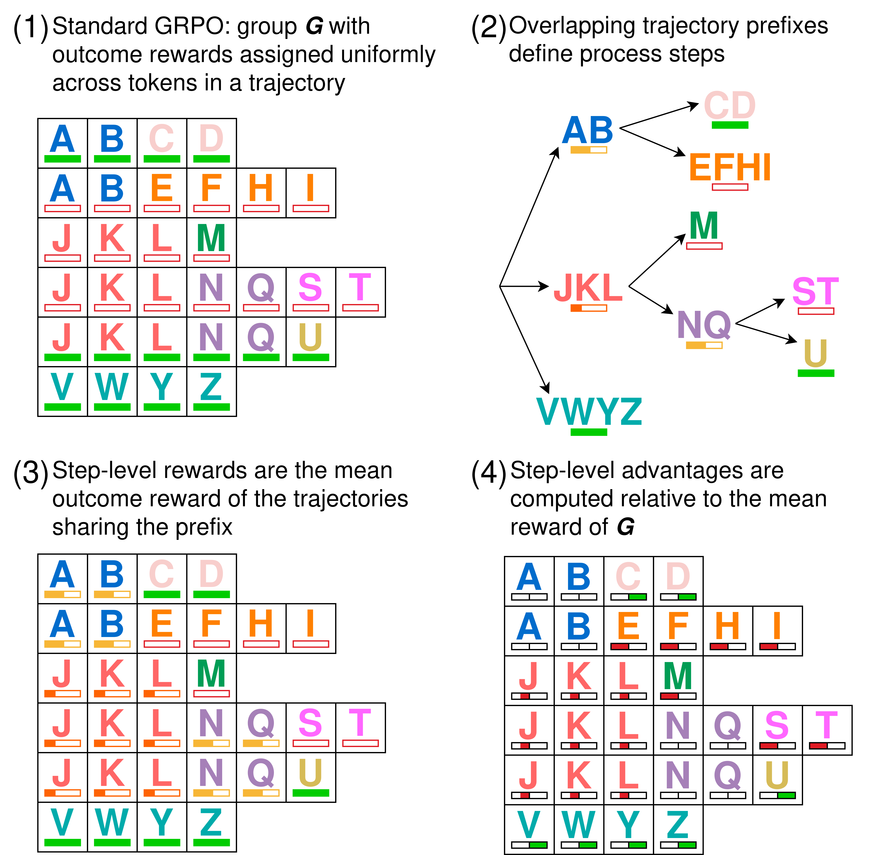

**UNDER CONSTRUCTION: this blog post is still under construction. It will be finished by ~June 18**

    

# Main Idea

**The short version:** an *outcome* reward model (ORM) scores a whole trajectory with a single number, while a *process* reward model (PRM) scores individual steps, which helps multi-step reasoning but normally demands costly training and step-level annotation. Group Relative Policy Optimization (GRPO; TODO: cite), the popular critic-free reinforcement learning (RL) algorithm, operates at the outcome-level: each completion has a single reward. 

So PRMs and GRPO look pretty unconnected, right? Surprisingly, no. We prove that **GRPO with a plain outcome reward is mathematically equivalent to a PRM-aware RL objective** equipped with a Monte-Carlo-based process reward model. The implicit PRM is built from overlapping trajectory prefixes inside each group, and these overlaps are everywhere in real-world training: in our experiments, 99.8%+ of groups induce non-trivial process rewards.

Why does this matter? We show that GRPO's implicit PRM carries a flaw: a frequency term silently over-weights frequently-occurring process steps, hurting both exploration and exploitation. We introduce λ-GRPO, a variant of GRPO that normalizes these imbalanced frequency effects, and beats GRPO on downstream reasoning and reaches peak validation accuracy in under half the steps, at negligible cost.

<b>Background (skip if already familiar with ORMs/PRMs and GRPO)</b>

  
  **ORMs and PRMs:** When you train a language model to reason with RL, you have to decide where the reward signal lives. The simplest choice is an ORM, where the model produces a full solution, and we hand back a single scalar for the entire trajectory. This is what we see in most RLVR and math-reasoning pipelines: $r = 1$ if the boxed answer matches, $r = 0$ otherwise.

  The problem here is credit assignment. A long chain of reasoning might be 99% correct and stumble on one arithmetic step, or wander for twenty lines before locking onto the right idea. An ORM treats every single token in that trajectory identically: either all the tokens were good ($r = 1$) or all the tokens were bad ($r = 0$). A PRM instead scores intermediate steps, so good early reasoning can be rewarded even when the final answer is wrong (or vice-versa).

  A drawback of *learned* PRMs is that learned they need labor-intensive step-level human annotation, they are off-policy, and they are notoriously easy to reward-hack. On the other hand, *Monte-Carlo* PRMs (e.g. TODO: cite) sample completions from a given step and use their average outcome reward as the step's value&mdash;i.e. a Monte-Carlo estimate of the expected future outcome reward from that step. 

  **GRPO:** effectively the default RL algorithm for reasoning today, precisely because it is cheap: it throws away PPO's critic model and generalized advantage estimation, and instead estimates advantage by comparing each completion against the mean of its group. It firmly, unambiguously operates over outcome-level rewards (the original Deepseek paper *does* define a PRM-aware GRPO, but it is a very different algorithm from the "normal" GRPO).
  
For each prompt/query $x$, GRPO samples a group $G$ of $k$ completions $y^{(i)}$ with rewards $r_i$​, and computes the group-relative advantage $a_i$:  

TODO: GRPO adv eq

GRPO optimizes the policy $\pi_\theta$ (i.e. the LLM we're training) to raise the probability of positive-advantage (above-average reward) completions and lower the probability of the negative-advantage (below-average reward) completions. After generating a group $G$, the policy is optimized for the following objective for $\mu$ iterations (technically, this is the *DAPO* objective; TODO: cite):

TODO: GRPO eqs here

Notice that every token in completion $y^{(i)}$ is multiplied by the same trajectory-level advantage $a_i$: that uniformity is what makes GRPO look like a purely outcome-reward-based method.

# Assumptions

Because it is the standard GRPO loss function employed in commonly used RL package, we assume the use of the DAPO objective (a variant of GRPO). For a clean a clean derivation, we assume that the number of update iterations $\mu=1$, so that we can ignore the PPO clipping factor. Under those two assumptions, we have the following GRPO optimization objective:

TODO: reduced GRPO objective here

# Overlapping prefixes induce process steps

Within a group, the sampled completions almost never stay disjoint&mdash;they share prefixes. For example, several trajectories within the same group might all begin "First, let's add 18 to both sides..." before branching apart. The key here is: **whenever a set of trajectories shares an opening prefix, that shared span behaves like a single process step**.

Let's walk through why. Suppose two completions $y^{(1)}$ and $y^{(2)}$ share the first two tokens, $AB$, then diverge. Say one ends up with above average reward ($a_1​=+1$), and the other below ($a_2=−1$). On the shared tokens $AB$, *the gradient of $y^{(2)}$ is the inverse of the gradient of $y^{(1)}$*: the gradient from $y^{(1)}$ pushes the probability up by +1 and that of $y^{(2)}$ pushes it down by −1&mdash;the forces cancel exactly. The net update on the shared prefix is zero, as if those tokens had been masked out of the loss entirely.

TODO: intuition fig here

Now let $a_3=+1$, $a_4=+1$, $a_5=−1$ on three completions $y^{(3)}$, $y^{(4)}$, $y^{(5)}$ sharing a prefix $JKL$. The net force on the shared span is (+1) + (+1) + (-1) = 1/3 + 1/3 + 1/3 = 1: identical to the sum of mean advantage of the trajectories passing through it (this is just basic arithmetic). That mean is precisely a Monte-Carlo estimate of the step's expected advantage.

**Defining the PRM:** we'll leave the technical derivation and proof of correctness of the PRM to the paper. The point is that because of GRPO's simple advantage estimation term, we can work backward and derive a Monte-Carlo PRM from the Monte-Carlo advantage estimate: averaging advantages is identical to averaging rewards, then computing the advantage of the averaged reward. 

For each trajectory $y^{(i)}$ and each token $t$ in $y^{(i)}$, we define a token-level reward $R_{i,t}$ as the mean outcome-level reward of each trajectory passing through the prefix-overlap-defined process step that $t$ belongs to.

TODO: example from slides

Then, we define the step-level advantage $A_{i,t}$ like in GRPO:

TODO: step-level advantage

Now we plug $A_{i,t}$ into a GRPO-like RL objective:

$L_\textit{PRM}$ is *clearly* a PRM-aware RL objective equipped with a Monte-Carlo-estimate PRM. But this is just a trick: $L_\textit{PRM}=L_\textit{GRPO}$&mdash;we can derive one from the other through simple algebraic manipulation. If what we defined above is a PRM-aware RL objective equipped with a Monte-Carlo-estimate PRM, then GRPO must be too, because $L_\textit{PRM}$ *is* $L_\textit{GRPO}$.

# Does overlap actually happen?

This is only interesting if the implicit PRM is non-trivial. If trajectories in a group never share prefixes, the tree is flat, every step is a whole trajectory, and the PRM collapses back into an ordinary ORM. So the next question is empirical: in actual GRPO training, do prefixes overlap enough to matter?

To measure this we trained two DeepSeek-R1-Distill-Qwen-1.5B models (group sizes 6 and 36) on the OpenRS (TODO: cite) math dataset, built the overlapping-prefix tree for every group, and tracked two quantities:

- **Path depth:** how many process steps sit between the root and a leaf. Smaller values mean a flatter, more trivial trees; larger ones mean richer prefix overlap.
- **Intermediate Proportion:** the fraction of a trajectory's tokens that fall inside a shared prefix (i.e. the share of tokens actually receiving non-trivial process reward).

TODO: graphs figure

At group size 6, only 12 of 6,700 trees were flat (about 0.2%), and at group size 36, not a single one of 1,100 trees was trivial. And 
both prefix-overlap metrics rise steeply as the policy converges and entropy drops: essentially **every group GRPO ever trained on carried a non-trivial, structured step-level reward signal** secretly derived from the outcome reward.

# Why secrets are bad

Because it's unintentional, it would be optimistic to assume the GRPO's secret PRM is actually a *good* PRM (it's not). Now that we've made the implicit PRM explicit, we can study and evaluate it. Consider the example in the figure below:

TODO: bad PRM ex

The prefix $JKL$ is shared by $JKLM,JKLNQST,JKLNQU$, whose mean reward is 0.33: this is below the group mean of 0.42, so the process step $JKL$ gets a *negative* advantage (-0.22), pushing its probability *down*. Because $JKL$ is repeated in three trajectories, its probability gets pushed down by a factor of -0.22 three times, even though $JKLM$ is the highest-reward trajectory in the group!

# λ-GRPO

To mitigate this imbalanced-freqency effect, we propose normalizing the GRPO loss for each token $y^{(i)}_t$ by the number of trajectories contained in the process step $\lambda^{(i,t)}$ that the token belongs to. THis gives us the PRM-aware λ-GRPO objective:

TODO: λ-GRPO equation

We evaluated GRPO and λ-GRPO on a toy, synthetic task using GPT-2-small (TODO: cite), so that we could assess their robustness to this imbalanced process step/reward frequency effect.

## The environment

Take a depth-four binary tree. At each step the model emits one of two tokens, $L$ or $R$ (everything else is masked), tracing a root-to-leaf path. We then rig the rewards to be adversarial:

- Sample one path as the *target* $T$ (say $LLRL$) and give it the maximum reward (+1.0)
- Pick a prefix length $n$. Every *other* path that shares the first $n$ tokens of $T$ gets a *negative* reward ($r_\textit{neg}<0$)
- All other paths get a reward of +0.7

TODO: tree env figure

This creates a trap, where the target's own siblings poison its shared prefix: if the trajectories $T = LLRL$, $X = LLLR$, and $Y = LLRR$ are in the same group, then the mean reward of the set {$T, X, Y$} is negative, so the process reward corresponding to the sub-trajectory $LL$ is negative as well.

For GRPO and λ-GRPO, we swept $n∈$ {1, 2} and $r_\textit{neg}∈$ {−0.5, −1.0, −1.5} with a group size of 16 for 250 steps, ran five seeds per configuration, and recorded how often the model produced the target $T$ over the last 50 steps. Under all configurations, λ-GRPO converges on the target $T$ more frequently than standard GRPO:

TODO: table 1

Zooming in on the row $n=1,r_\textit{neg}=-1.0$, we see that GRPO-trained models *do* generate the target early on. They didn't fail to discover $T$: they failed to exploit it, because its prefix had negative step-level reward.

TODO: figure 5

# Downstream results

Next, we evaluated λ-GRPO against GRPO on actual training data and evaluation benchmarks. We fine-tuned DeepSeek-R1-Distill-Qwen-1.5B and Llama-3.2-1B-Instruct on OpenRS with λ-GRPO and standard GRPO under identical settings (two KL coefficients, $β∈$ {0, 0.04}), then evaluated on five reasoning benchmarks. λ-GRPO beats standard GRPO on 15 of 20 benchmark cells and improves over the untuned base on 14 of 20, with gains holding across both model families and both KL settings:

TODO: Table 2

# Conclusion

TODO: finish

# References

TODO
