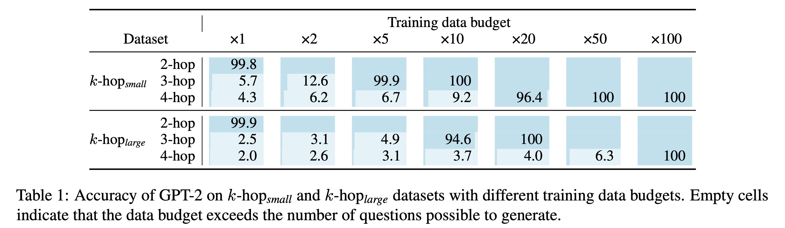

    

## Abstract

Implicit reasoning is the ability of a language model to solve multi-hop reasoning tasks in a single forward pass, without chain of thought. We investigate this capability using GPT2-style language models trained from scratch on controlled $k$-hop reasoning datasets ($k = 2, 3, 4$). We show that while such models can indeed learn implicit $k$-hop reasoning, the required training data grows exponentially in $k$, and the required number of transformer layers grows linearly in $k$. We offer a theoretical explanation for why this depth growth is necessary. We further find that the data requirement can be mitigated, but not eliminated, through curriculum learning.

## LMs can learn $k$-hop reasoning, but at a large data cost

We first demonstrate that GPT-2 style models trained from scratch are able to solve $k$-hop reasoning tasks, even without explicit intermediate steps. However, this comes at a cost: the number of training examples required increases exponentially with the number of hops $k$​.

    

## LMs reason through layer-wise lookup, incurring the cost of depth

The second objective is to understand the underlying mechanism by which language models solve the $k$-hop task. We first demonstrate that language models solve such tasks by layer-wise lookup of bridge entities of a $k$-hop query through empirical evidence (e.g. mechanistic interpretability). Building on this finding, we then establish a theoretical lower bound, showing that the model’s depth must grow with $k$ to maintain such layer-wise lookup mechanism.

    
    

        <em>Figure 1: Causal effects across layers at the last input token position. C_i-hop refers to the effect of a particular intermediate bridge entity, which is calculated according to a corrupted run with i-hop bridge entity corrupted while others unchanged. </em>
    

## Curriculum learning mitigates the data requirement, but doesn't solve it

Finally, we study training strategies to improve the data budget issue. Models mentioned above were trained solely on $k$-hop task, but  $i$-hop ($i < k$) questions should also be available in realistic setups. By exploiting such easier questions as additional training data for $k$-hop task, we demonstrate that curriculum learning significantly mitigates the exponential growth issue, though not eliminate the increase of data budget as $k$ increases. Instead, simply mixing all training data only yields modest improvement. 

    

We attribute this effectiveness of curriculum learning to a stepwise build-up of circuits: 
According to our mechanism study (e.g. activation patching) in Figure 2 and 3, 
mechanisms retrieving lower-hop entities (e.g., $1$-hop) emerge in the early training stages; 
subsequent stages then build upon these established circuits to learn more complex reasoning tasks.
While baseline models have to construct a full circuit for $k$-hop reasoning at once, 
curriculum learning enables $1$-hop circuits to emerge in shallower layers in the first stage, with later stages developing circuits for $2$-hop and $3$-hop entities on top of these.

    
    

        <em>Figure 2: Causal effects across checkpoints and layers for 1-hop to 3-hop reasoning in Baseline model.</em>
    

    
    

        <em>Figure 3: Causal effects across checkpoints and layers for 1-hop to 3-hop reasoning in Curriculum Learning model.</em>
    

