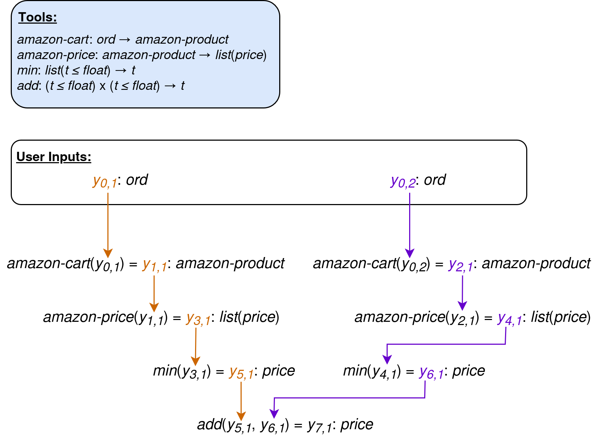
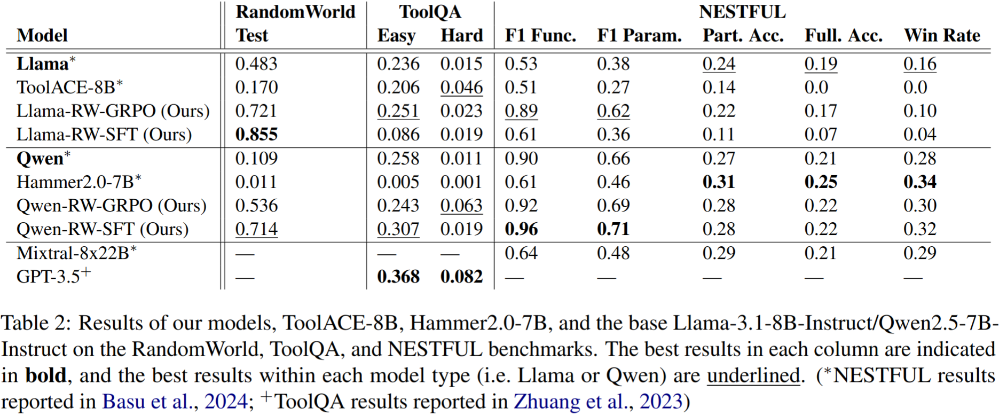

    

# RandomWorld

We introduce RandomWorld, a pipeline for the procedural generation of tools and tasks for the online RL (or SFT) training of tool-use agents, that can generate a virtually unlimited amount of training data. While such pipelines exist, they are comprised of either small or non-interactive (i.e. not callable) tool inventories, and/or non-compositional or linear tasks. This results in training datasets that can teach models to master simpler tool-use benchmarks (e.g. BFCL-V3; Yan et al., 2024), but that fail to satisfactorily improve model performance on benchmarks with more complex tasks: namely, tasks necessitating the non-linear chaining of tool calls in an interactive setting, such as ToolQA (Zhuang et al., 2023), NESTFUL (Basu et al., 2024), AppWorld (Trivedi et al., 2024), etc.

In contrast, the Randomorld pipeline procedurally generates environments that have:

1. **Depth (of the tool inventory)**: a large toolset across a diverse assortment of domains, to facilitate the agent's ability to generalize to unseen tools.
2. **(Non-linear) Compositionality**: chainable tools&mdash;and objectives necessitating non-linear tool-chaining&mdash;to emulate complex, real-world tasks.
3. **Interactivity**: intermediate tool outputs that are visible to the agent, allowing the inspection of outputs and (if necessary) correction of the tool-call sequence&mdash;as is possible in many real-world settings.

Models fine-tuned through either RL or SFT with RandomWorld exhibit increased performance on multiple tool-use benchmarks, and set the new SoTA on two NESTFUL metrics. We also show that downstream performance scales with the size of the tool inventory and number of tasks in the training set: this indicates that further training with RandomWorld can further improve performance, without the need for costly human annotation.

# The Pipeline

### Type System

Tool and environment generation in RandomWorld are guided by its fine-grained type system. We constructed 73 base types: fine-grained subtypes of strings (e.g. *month-name*, *movie-title*, *address*), integers (e.g. *age*, *year*, *spotify-id*), and floats (e.g. *hotel-rating*, *temperature*, *price*), with further sub-type constraints within this set of custom types: for example, *actor-name* is a subtype of *person-name* (which in turn is a subtype of *string*). 

<b>Type Hierarchy:</b>

  

 

For each of these base types, we craft a description, a generator, and a recognizer. Type generators create new instances of that type, and are used to produce automatically-generated tool outputs: for example, the generator for *month-name* simply samples one of the twelve month names, while the generator for price samples a float between 1 and 5000, rounded to two decimal points. Type recognizers are boolean-valued functions that check if an object belongs to the type in question, and are used for type-checking inputs to randomly-generated tools.

<b>Examples of Types, Descriptions, and Instances (Sampled from Generators):</b>

  

 

We also implemented three type constructors, that allow for the generation of a theoretically unlimited number of types (recognizers/generators/subtype relations for constructed types are automatically inferred from their constituent types):
- *list* : *T* → *T* takes a type *t* and returns the type *list*(*t*) of lists of objects of type *t*
- *dict* : *T* x *T* → *T* takes types *t*, *u* and returns the type *dict*(*t*, *u*) of dictionaries mapping objects of type *t* to objects of type *u*
- *union* : *T* x *T* → *T* takes types *t*, *u* and returns the type *union*(*t*, *u*) of objects of type *t* or *u*

### Tool Creation

We automatically generate tools (LLM-callable functions) in RandomWorld by sampling input types *A1*, ..., *An* and output types *B1*, ..., *Bm*, then using an LLM to generate a name and description for a tool *f* : *A1* x ... x *An*  →  *B1* x ... x *Bm* (filtering out the unreasonable ones). 

When passed inputs *a1*, ..., *an*, the tool returns *b1*, ..., *bm*, where each *bi* is sampled from the type generator for *Bi*. While the agent is interacting with the environment, we temporarily store input/output pairs ((*a1*, ..., *an*), (*b1*, ...,*bm*)): this ensures that the tool always returns the same output for a given input (from the agent's perspective).

Because a tool in RandomWorld is just a function annotated with input/output types, we can also use hand-crafted tools in place of&mdash;or alongside&mdash;synthetic tools. For example, we implemented six hand-crafted calculator tools in our experiments: *add*, *subtract*, *multiply*, *divide*, *max*, and *min*.

### Task Generation

RandomWorld tasks are synthesized by first generating a sequence of API calls through a type-guided sampling procedure, to create a data structure that we call a *trajectory skeleton*: a sequence of tool calls *f1*, ..., *fn*, along with annotations indicating the output(s) of the tool(s) *fm*, ..., *fk* that *fi* takes as input (*m*, *k* < *i*). For example, the non-linear trajectory skeleton below corresponds to the instruction *"how much will the y0,1-th and y0,2-th most recently-added items in my Amazon cart cost together, if purchased at the lowest-available price?"*

 

  

 

These trajectory skeletons begin with sampled *user input* type(s) *Y0,1*, ..., *Y0,m*, which correspond to the value(s) that will be fed to the agent in the instruction: e.g. *"find <ins>comedy</ins> movies on Netflix that last less than <ins>two</ins> hours"* (*comedy*: *movie-genre*, *two*: *hour-duration*). 

We add a new tool call to the trajectory skeleton by sampling a tool whose input type(s) are compatible with the types of the variables currently in play: the user input types, along with (variables representing) the output values of each existing tool call in the trajectory skeleton. We continue sampling new tools to add to the trajectory skeleton until the tool call sequence reaches a pre-sampled length, and the output of the last tool call is then taken as the value to be returned by the agent to complete the task (the *goal state*).

### Environment Generation

Once the trajectory skeleton has been generated, we sample user input values and compute output values for each tool call in the sequence, thereby populating an *environment*: a data structure that contains tool input/output values, user information (see below), a goal state, and an instruction. 

After the environment has been populated from a trajectory skeleton, we prompt an LLM to generate an instruction for that environment, given descriptions of each tool in the trajectory, the value(s) of the user input(s), and the trajectory skeleton. We use a filtering mechanism to ensure that the LLM-generated instructions always contain enough information to reach the goal state.

### Agent Interface

RandomWorld is fully compatible with TRL (von Werra et al., 2020) text environments: for evaluation and RL training, we simply create a text environment for each RandomWorld environment, and pass the agent and the RandomWorld environment's tools to the text environment.

For SFT training, we use the trajectory skeleton and stored tool input/output values to automatically construct a training instance that reaches the goal state. 

# Experiment: Training on RandomWorld

We fine-tuned Llama-3.1-8B-Instruct and Qwen2.5-7B-Instruct on 12,000 RandomWorld environments generated from a set of six hand-crafted and 550 procedurally-generated tools. For each model, we trained one variant using online RL (Group Relative Policy Optimization \[GRPO\]; Shao et al., 2024) and one with standard SFT. 

We then evaluated these models on three benchmarks: ToolQA, NESTFUL, and a RandomWorld test set generated from 75 tools not seen during training. We compared our Qwen models (Qwen-RW-GRPO and Qwen-RW-SFT) to Hammer2.0-7B (Lin et al., 2025), a Qwen2.5-7B-Instruct model fine-tuned via SFT on an augmented version of the xlam-function-calling-60k tool-use dataset (67.5k examples; Zhang et al., 2024). Our Llama models (Llama-RW-GRPO and Llama-RW-SFT) were compared to ToolACE-8B, a Llama-3.1-8B-Instruct model fine-tuned (SFT) on the ToolACE dataset (11.3k examples; Liu et al., 2024).

 

  

 

- **Qwen-RW-SFT achieves NESTFUL SoTA:** on the NESTFUL benchmark, our Qwen-RW-SFT model sets the SoTA for the F1-Function (0.96) and F1-Parameter (0.71) scores, both of which reflect the correctness of the predicted API calls. In fact, aside from Llama-RW-SFT, all of our models outperform the previous SoTA (Mixtral-8x22B-Instruct-v0.1).
- **Synthetic data improves model performance:** the superior performance of Llama-RW-GRPO over Llama-RW-SFT (and ToolACE-8B) demonstrates the utility of a synthetic data-creation pipeline for tool-use that is compatible with online RL tuning, while the SoTA and near-SoTA results of Qwen-RW-SFT show the importance of a pipeline compatible with both kinds of fine-tuning.
- **Data quality matters:** our Llama models generally outperform ToolACE-8B (another Llama-3.1-8B-Instruct model fine-tuned on a similar amount of tool-use data), and our Qwen models generally outperform Hammer2.0-7B (another Qwen2.5-7B-Instruct model fine-tuned on almost 7x more tool-use data). The fact that both Qwen-RW-SFT and Hammer2.0-7B are trained via SFT on synthetic tool-use data raises the question as to why our model outperforms Hammer2.0-7B: we hypothesize that RandomWorld's non-linear, trajectory-skeleton-driven task-creation pipeline generates more complex tasks than an LLM-driven task-creation pipeline&mdash;such as those used by Hammer2.0-7B and ToolACE-8B&mdash;is capable of envisioning. This likely provides our models with a richer training set than those of the baseline models.

# Experiment: Scalability

Next, we examined the effect of number of synthetic tools and tasks on downstream performance. We fine-tuned Qwen2.5-7B-Instruct on three datasets:

- **100% tools/25% tasks:** designed to evaluate the effect of task number, constructed by randomly removing 75% of the tasks from the original training set used in the first experiment.
- **25% tools/100% tasks:** designed to evaluate the effect of tool inventory size, constructed by removing 75% of the tools from the original training set, then generating 12,000 unique tasks from that restricted tool set.
- **25% tools/25% tasks:** constructed from the 25% tools/100% tasks set by by randomly removing 75% of the tasks.

 

  

 

These results are most pronounced on the RandomWorld test set: Qwen-RW-GRPO performed worse than the base model on ToolQA-Easy&mdash;explaining the observed *increased* performance when trained on fewer tasks&mdash;and NESTFUL is not fully in-distribution with respect to RandomWorld, so we would not expect a marked effect on those benchmarks. But, on the RandomWorld test set, we observe that:

- **Tasks are more important than tools:** tuning on the 25% tools/100% tasks set only slightly decreases RandomWorld test set performance. Conversely, tuning on 100% tools/25% tasks results in more sizable decrease.
- **... But tools gain importance with fewer tasks:** the model tuned on the 100% tools/25% tasks set substantially outperforms that tuned on 25% tools/25% tasks.

# References

Kinjal Basu, Ibrahim Abdelaziz, Kiran Kate, Mayank Agarwal, Maxwell Crouse, Yara Rizk, Kelsey Bradford, Asim Munawar, Sadhana Kumaravel, Saurabh Goyal, et al. 2024. Nestful: A Benchmark for Evaluating LLMs on Nested Sequences of API Calls. *arXiv preprint arXiv:2409.03797*.

Qiqiang Lin, Muning Wen, Qiuying Peng, Quanyu Nie, Junwei Liao, Jun Wang, Xiaoyun Mo, Jiamu Zhou, Cheng Cheng, Yin Zhao, Jun Wang, and Zhang Weinan. 2025. Robust Function-Calling for On-Device Language Model via Function Masking. In *The Thirteenth International Conference on Learning Representations*.

Weiwen Liu, Xu Huang, Xingshan Zeng, Xinlong Hao, Shuai Yu, Dexun Li, Shuai Wang, Weinan Gan, Zhengying Liu, Yuanqing Yu, et al. 2024a. ToolACE: Winning the Points of LLM Function Calling. *arXiv preprint arXiv:2409.00920*.

Zhihong Shao, Peiyi Wang, Qihao Zhu, Runxin Xu, Junxiao Song, Xiao Bi, Haowei Zhang, Mingchuan Zhang, YK Li, Y Wu, et al. 2024. DeepSeekMath: Pushing the Limits of Mathematical Reasoning in Open Language Models. arXiv preprint arXiv:2402.03300.

Harsh Trivedi, Tushar Khot, Mareike Hartmann, Ruskin Manku, Vinty Dong, Edward Li, Shashank Gupta, Ashish Sabharwal, and Niranjan Balasubramanian. 2024. AppWorld: A Controllable World of Apps and People for Benchmarking Interactive Coding Agents. In *Proceedings of the 62nd Annual Meeting of the Association for Computational Linguistics (Volume 1: Long Papers)*, 16022–16076.

Leandro von Werra, Younes Belkada, Lewis Tunstall, Edward Beeching, Tristan Thrush, Nathan Lambert, Shengyi Huang, Kashif Rasul, and Quentin Gallouédec. 2020. TRL: Transformer Reinforcement Learning. [https://github.com/huggingface/trl](https://github.com/huggingface/trl).

Fanjia Yan, Huanzhi Mao, Cheng-Jie Ji, Tianjun Zhang, Shishir G. Patil, Ion Stoica, and Joseph E. Gonzalez. 2024. Berkeley function calling leaderboard.

Jianguo Zhang, Tian Lan, Ming Zhu, Zuxin Liu, Thai Hoang, Shirley Kokane, Weiran Yao, Juntao Tan, Akshara Prabhakar, Haolin Chen, et al. 2024. xLAM: A Family of Large Action Models to Empower AI Agent Systems. *arXiv preprint arXiv:2409.03215*.

Yuchen Zhuang, Yue Yu, Kuan Wang, Haotian Sun, and Chao Zhang. 2023. ToolQA: A Dataset for LLM Question Answering with External Tools. *Advances in Neural Information Processing Systems*, 36:50117–50143.
