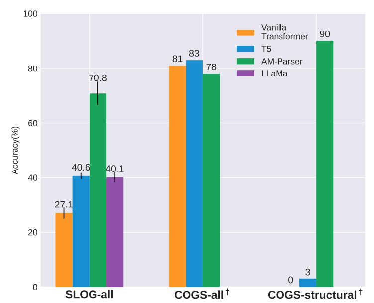

    

## Abstract

The goal of **compositional generalization benchmarks** is to evaluate how well models generalize to new complex linguistic expressions. Existing benchmarks often focus on lexical generalization, the interpretation of novel lexical items in syntactic structures familiar from training; structural generalization tasks, where a model needs to interpret syntactic structures that are themselves unfamiliar from training, are often underrepresented, resulting in overly optimistic perceptions of how well models can generalize. We introduce SLOG, a semantic parsing dataset that **extends COGS (Kim and Linzen, 2020) with 17 structural generalization cases**. In our experiments, the generalization accuracy of Transformer models, including pretrained ones, only reaches 40.6%, while a structure-aware parser only achieves 70.8%. These results are far from the near-perfect accuracy existing models achieve on COGS, demonstrating the role of SLOG in **foregrounding the large discrepancy between models' lexical and structural generalization capacities**.

## Structural Compositional Generalization

Compared to COGS, SLOG introduces 17 new generalization types. All of them require a semantic parser to generalize to structures
that were unseen at training time. These include **new recursive constructions** (e.g. center embedding)
and **long-distance dependencies** introduced by relative clauses and wh-questions. 

We find that these new structural generalization types
are not just difficult for pretrained and non-pretrained transformers - this was already [known for COGS](https://aclanthology.org/2022.emnlp-main.337/) - but even for large language models such as LLaMa and structure-aware models such as the AM parser.

 
Overall, SLOG demonstrates that compositional generalization remains a challenge even for the
best semantic parsers, and with its focus on structural generalization, invites future work
that focuses on linguistic constructions that make semantics difficult.

