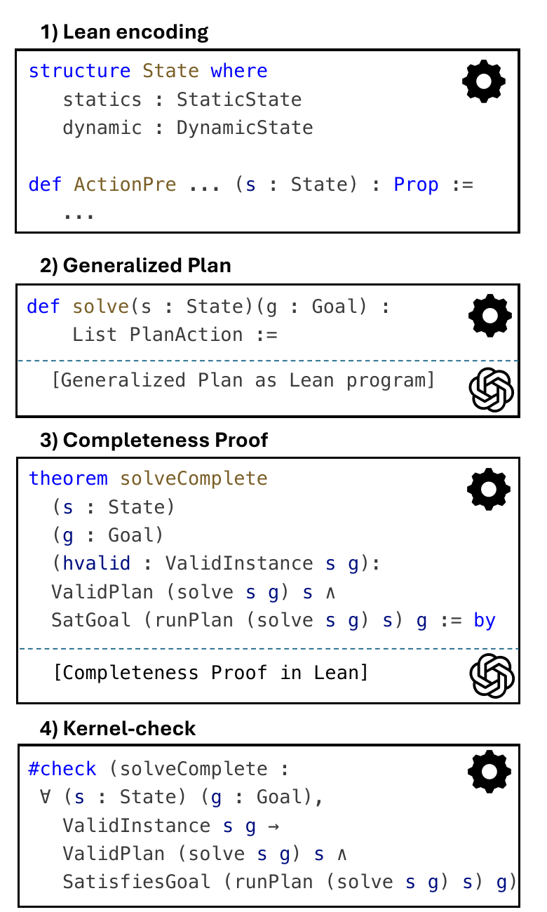
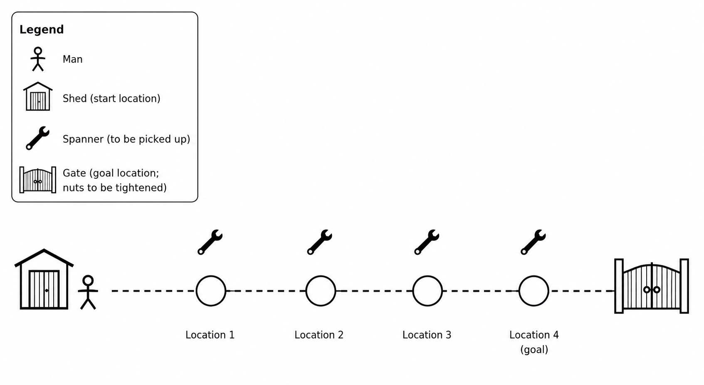

<section class="vgp-section vgp-teaser">
  

    <figure class="vgp-main-figure">
      
    </figure>
    

      <h2>Overview</h2>
      
LLMs have shown strong performance on <i>generalized planning</i>, i.e. the generation of programs that solve instances of a given PDDL planning domain. However, LLM-generated code does not guarantee universal correctness on arbitrary instances. We show for the first time how to generate generalized plans with LLMs in a way that guarantees correctness of the plans.

      
We achieve this by using the LLM to synthesize generalized plans as Lean programs, together with correctness proofs that are then automatically checked by Lean.
      We evaluate the method on 13 planning domains. It produces a Lean-checked correctness proof for 12 of them. For the remaining domain, Transport, the generated plan still has perfect test coverage.

    

  

</section>

<section class="vgp-section vgp-section-white">
  

    <h2>From finite evaluation to a completeness statement</h2>
    
A generalized plan is intended to solve all instances of a planning domain. Evaluation on a fixed test set can establish coverage on those instances, but it does not establish completeness for the domain.

    

      <section>
        <h3>Finite evaluation</h3>
        
The generated program is executed on a finite collection of planning tasks. This measures coverage on the test set but leaves instances outside that set unexamined.

      </section>
      <section>
        <h3>Completeness theorem</h3>
        
The theorem quantifies over every possible initial state and goal that satisfies the stated domain constraints, and states that the generalized plan computes a valid plan for this input. We generate the theorem; the LLM generates a proof; Lean checks it.

      </section>
    

    <figure class="vgp-spanner-example">
      
      <figcaption><strong>Example: Spanner.</strong> Move from the shed to the gate. At each intermediate location, pick up every spanner. At the gate, tighten each loose nut with a different spanner.</figcaption>
    </figure>
  

</section>

<section class="vgp-section vgp-section-dark">
  

    <h2>Method</h2>
    
The method has four stages: encoding the PDDL semantics in Lean, generating a generalized plan, generating its completeness proof, and checking the result with Lean’s kernel.

    

      <article class="vgp-step">
        <h3>Lean encoding</h3>
        
States, goals, actions, preconditions, and effects are automatically translated into Lean by domain-independent Python code. The translation preserves the semantics of PDDL.

      </article>
      <article class="vgp-step">
        <h3>Generalized plan</h3>
        
The LLM implements a "solve" function in Lean that maps a Lean-encoded PDDL instance to a list of planning actions.

      </article>
      <article class="vgp-step">
        <h3>Completeness proof</h3>
        
The LLM constructs a Lean proof for the correctness of the "solve" function.

      </article>
      <article class="vgp-step">
        <h3>Lean check</h3>
        
Lean verifies that the proof actually establishes correctness of the generated code. If it doesn't, the LLM revises the generalized plan and the proof until Lean accepts them.

      </article>
    

  

</section>

<section class="vgp-section vgp-section-white">
  

    

      <h2>The completeness theorem</h2>
      
The completeness statement quantifies over all valid initial states and goals. Its conclusion has two parts: every action returned by <code>solve</code> is sequentially applicable, and executing the plan reaches a state satisfying the goal.

       

      
The theorem itself is generated by Python code under our control (see box to the right). We also generate Lean functions that encode the preconditions and effects of each action, as specified by the PDDL domain (see the image at the top of the page). Thus, the LLM cannot prove a different theorem instead.

       

      
The PDDL domain by itself does not fully specify what the initial state may look like. For example, in the Spanner example above, a solvable instance must have at least as many spanners as nuts. We capture the specification of permissible instances in <i>validity constraints</i>; the completeness theorem is then about all valid instances.

    

    

      <pre><code>theorem solveComplete
  (s : State)
  (g : Goal)
  (hinit : ValidInit s)
  (hgoal : ValidGoal s g) :
  ValidPlan (solve s g) s ∧
  SatisfiesGoal
    (runPlan (solve s g) s) g := by
  -- LLM-generated proof,
  -- checked by Lean's kernel</code></pre>
    

  

</section>

<section class="vgp-section" id="experimental-results">
  

    <h2>Experimental results</h2>
    
We used GPT-5.6-Sol to generate generalized plans in Lean for 13 test domains. The proof-generation procedure completed a Lean-checked proof for 12 domains. For Transport, the generalized plan achieved full coverage on the easy and medium IPC Learning Track test splits, but the proof-generation procedure did not complete a proof.

    
Seven proofs were generated and debugged as a whole. For five further domains, the LLM first produced a proof sketch and then completed it one declaration at a time. Total runtime for the domains with completed proofs ranged from 9 to 54 minutes. Crucially, this time has to be invested only once for each PDDL domain. After a generalized plan has been computed, it can simply be run as a program to solve PDDL test instances in milliseconds.

    

      <table class="table vgp-domain-table">
        <thead><tr><th>Domain</th><th>Outcome</th><th>Proof mode</th><th>LLM interactions</th><th>Total time</th><th>Lean proof</th></tr></thead>
        <tbody>
          <tr><td>Delivery</td><td>Proved</td><td>Basic</td><td>1 GP + 3 proof</td><td>13 min</td><td><a href="static/materials/verifiedgenplan/lean-proofs/delivery/3_runnable_proof.lean">Lean file</a></td></tr>
          <tr><td>Ferry</td><td>Proved</td><td>Basic</td><td>2 GP + 3 proof</td><td>12 min</td><td><a href="static/materials/verifiedgenplan/lean-proofs/ferry_ipc/5_runnable_proof.lean">Lean file</a></td></tr>
          <tr><td>Grippers</td><td>Proved</td><td>Basic</td><td>2 GP + 3 proof</td><td>13 min</td><td><a href="static/materials/verifiedgenplan/lean-proofs/grippers/5_runnable_proof.lean">Lean file</a></td></tr>
          <tr><td>Heavy</td><td>Proved</td><td>Basic</td><td>1 GP + 3 proof</td><td>9 min</td><td><a href="static/materials/verifiedgenplan/lean-proofs/heavy/4_runnable_proof.lean">Lean file</a></td></tr>
          <tr><td>Hiking</td><td>Proved</td><td>Basic</td><td>1 GP + 2 proof</td><td>12 min</td><td><a href="static/materials/verifiedgenplan/lean-proofs/hiking/4_runnable_proof.lean">Lean file</a></td></tr>
          <tr><td>Logistics</td><td>Proved</td><td>Basic</td><td>1 GP + 3 proof</td><td>20 min</td><td><a href="static/materials/verifiedgenplan/lean-proofs/logistics/4_runnable_proof.lean">Lean file</a></td></tr>
          <tr><td>Satellite</td><td>Proved</td><td>Basic</td><td>1 GP + 4 proof</td><td>27 min</td><td><a href="static/materials/verifiedgenplan/lean-proofs/satellite/6_runnable_proof.lean">Lean file</a></td></tr>
          <tr><td>Blocksworld</td><td>Proved</td><td>Iterative</td><td>2 GP + 24 proof</td><td>30 min</td><td><a href="static/materials/verifiedgenplan/lean-proofs/blocksworld_ipc/42_runnable_proof.lean">Lean file</a></td></tr>
          <tr><td>Goldminer</td><td>Proved</td><td>Iterative</td><td>1 GP + 36 proof</td><td>47 min</td><td><a href="static/materials/verifiedgenplan/lean-proofs/goldminer/50_runnable_proof.lean">Lean file</a></td></tr>
          <tr><td>Miconic</td><td>Proved</td><td>Iterative</td><td>1 GP + 11 proof</td><td>25 min</td><td><a href="static/materials/verifiedgenplan/lean-proofs/miconic/5_runnable_proof.lean">Lean file</a></td></tr>
          <tr><td>Rovers</td><td>Proved</td><td>Iterative</td><td>1 GP + 45 proof</td><td>54 min</td><td><a href="static/materials/verifiedgenplan/lean-proofs/rovers_ipc/64_runnable_proof.lean">Lean file</a></td></tr>
          <tr><td>Spanner</td><td>Proved</td><td>Iterative</td><td>1 GP + 36 proof</td><td>49 min</td><td><a href="static/materials/verifiedgenplan/lean-proofs/spanner/5_runnable_proof.lean">Lean file</a></td></tr>
          <tr><td>Transport</td><td>Tests pass</td><td>—</td><td>1 GP</td><td>4 min GP</td><td>—</td></tr>
        </tbody>
      </table>
    

  

</section>

<section class="vgp-bibtex">
  

    <h2>BibTeX</h2>
    <pre><code>@misc{stein2026provablycomplete,
  title  = {Provably Complete Generalized Planning with LLMs},
  author = {Katharina Stein and Chaahat Jain and J{\"o}rg Hoffmann
            and Alexander Koller},
  year   = {2026},
  note   = {Manuscript}
}</code></pre>
  

</section>
